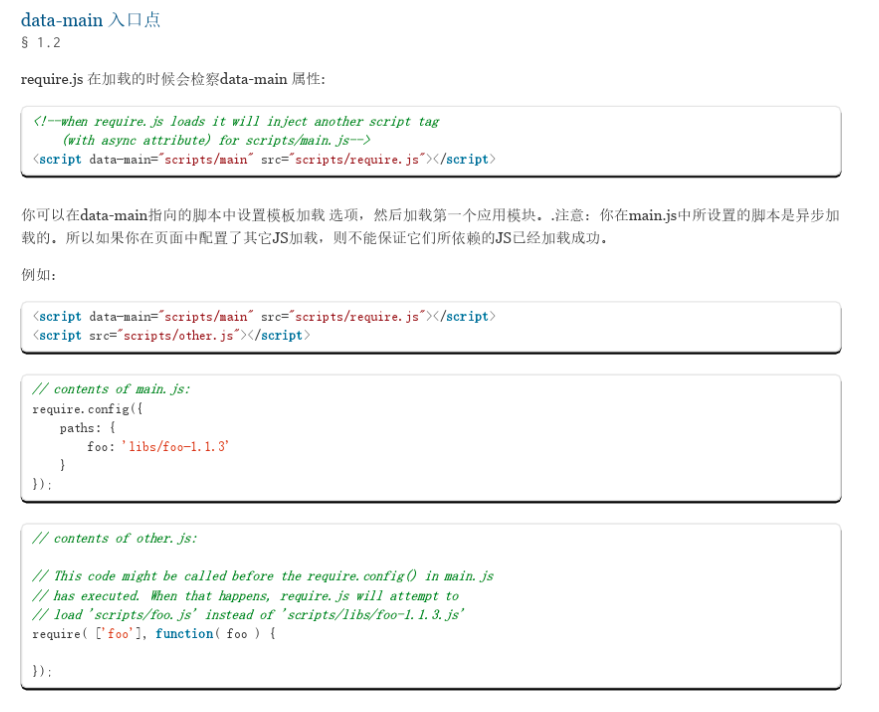
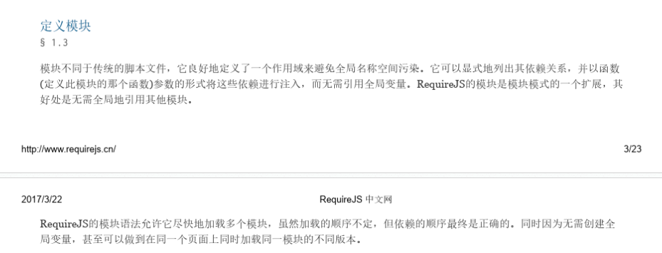
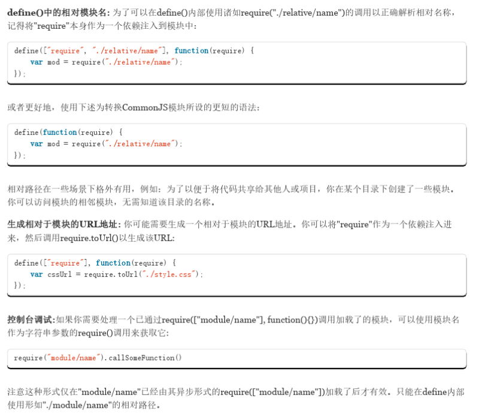
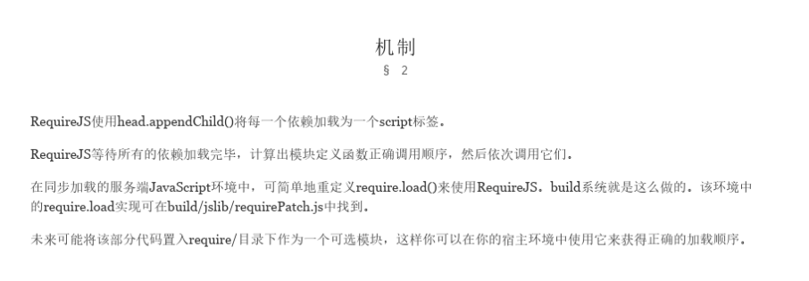

[中文文档](https://wenku.baidu.com/view/836bd9c8112de2bd960590c69ec3d5bbfd0adad2.html) | [官方文档](https://requirejs.org/) | [AMD 规范](https://github.com/amdjs/amdjs-api/wiki/require-(中文版)) 

---

- RequireJS是一个工具库，主要用于客户端的模块管理。它可以让客户端的代码分成一个个模块，实现异步或动态加载，从而提高代码的性能和可维护性。它的模块管理遵守[AMD规范](https://github.com/amdjs/amdjs-api/wiki/AMD)（Asynchronous Module Definition）。

  RequireJS的基本思想是，通过define方法，将代码定义为模块；通过require方法，实现代码的模块加载。

- define 中的第一个参数是什么

  - 在 `html` 页面中引用的第一种方式，是使用 `data-main` 来定义程序需要启动的主`js` 文件

    ```html
    <!-- data-main attribute tells require.js to load
                 scripts/main.js after require.js loads. -->
    <script data-main="scripts/main" src="scripts/require.js"></script>
    ```

  - 在`html` 中页面引入，第一个通常是个配置的 `js` 文件，然后第二个就加载主`JS` 文件，不用第二个参数了

    ```html
    <script src="js/lib/require.js"></script>
    <script>
        //Load common code that includes config, then load the app
        //logic for this page. Do the requirejs calls here instead of
        //a separate file so after a build there are only 2 HTTP
        //requests instead of three.
        requirejs(['./js/common'], function (common) {
            //js/common sets the baseUrl to be js/ so
            //can just ask for 'app/main1' here instead
            //of 'js/app/main1'
            requirejs(['app/main1']);
        });
    </script>
    ```

  - 第一关中的引入，可以在第二个参数中使用前一个的参数

  ```js
  // 这种第一个是引入 jquery  第二个函数就可以使用引入的 jquery 了
  define(['jquery'], function ($) {
      return {
          getBody: function () {
              return $('body');
          }
      }
  });
  ```

  - 第一个参数是引入一个其他的`js` 文件，然后参数传入到第二个function中，可以直接使用

    ```js
    define(['./Base'], function (Base) {
        var m1 = new Base('This is the data for Page 1');
        return m1;
    });
    ```

  - 第一个就是一个 function，但是参数就是 `require` ，如果函数内不需要加载其他的`js` ，那么也不可以不穿 `require` 

    ```js
    define(function (require) {
        var $ = require('jquery'),
            lib = require('./lib'),
            
    });
    ```
    
  - 查看[官方文档](https://github.com/amdjs/amdjs-api/wiki/require-(中文版))的定义

    使用define()定义模块时，依赖项中可以找到一个AMD模块：

    ```js
        define(function (require) {
            var a = require('a');
        });
    ```

    工厂方法可以被解析成require('')的调用形式（例如，使用语法解析器或者使用Function.prototype.toString()或者正则表达式）去找到依赖，加载并且执行依赖，然后执行工厂方法内部代码，通过这样的方式，就可以获取到模块。

- `main.js` 中所设置的脚本是异步加载的

  - `requirejs` 遵循的是 `amd` 规范，是在浏览器运行的，所以是异步的，`commonjs` 是运行在 `node` 中， 是同步的，参考官方文档 [COMMONJS NOTES](https://requirejs.org/docs/commonjs.html)

  

- 定义模块

  

- 存在依赖的函数式定义

  

- 相对模块以及相对模块的 URL

  

- 机制

  


