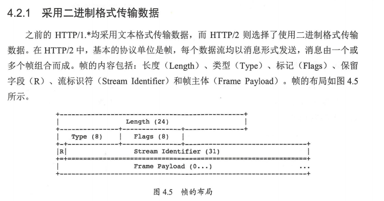
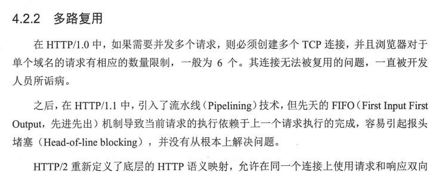
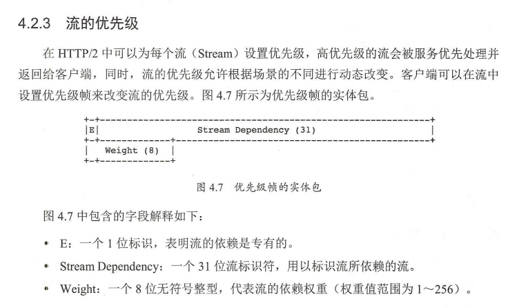
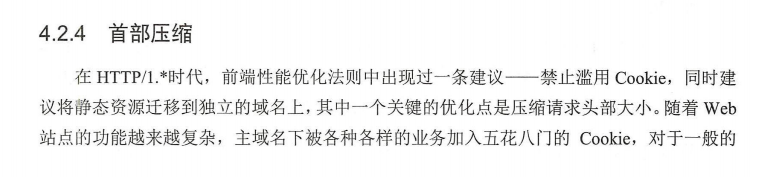
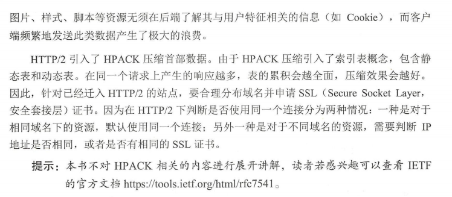
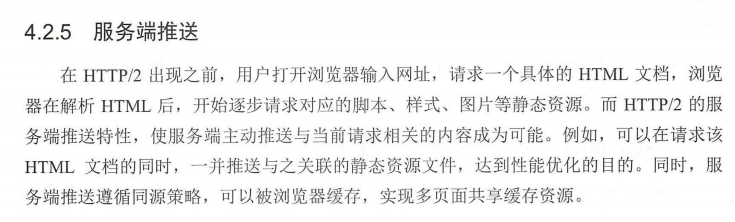
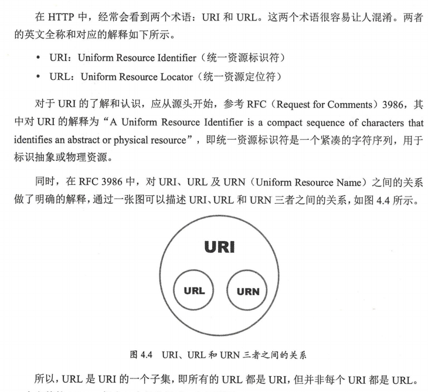

- HTTP历史

  - 1991 年 发布 0.9版本

    - 只支持 GET 请求，用于传输基础的文本内容
    - [协议文档地址](https://www.w3.org/Protocols/HTTP/AsImplemented.html)

  - 1996年发布 1.0 版本

    - 增加了访问不同对象类型的功能，不仅可以传输文本，还可以传输图像、视频、二进制文件等在 get 请求命令的基础上，增加了 post, put, head, delete, link 等命令，还增加了头部信息，如`User-Agent`, `Accept`, `Last-Modified`, `Content-Type` 等
    - [协议文档地址](https://www.w3.org/Protocols/HTTP/1.0/spec.html)

  - 1997 年发版 1.1版本

    - 部分改进如下
      - 默认使用持久连接(Persistent Connections) 的机制
      - 引入管道方式(Pipelining) 支持多请求发送
      - 请求增加了 host 字段，使一台物理服务器中可以存在多个虚拟主机，共享同一IP地址
      - 响应头增加了 `Transfer-Encoding` 字段，引入了 chunked 分块传输编码机制
      - 增加了 `Cache-Control` 头域，缓存机制更加灵活强大
      - 增加了 `Content-Range` 头域，实现宽带优化
      - 新增多种请求方法：`OPTIONS`, `TRACE`, `CONNECT` 等
      - 新增24个 `HTTP` 状态码，如 203、205、206、303、306、307等
    - [文档协议地址](w3.org/Protocols/rfc2616/rfc2616.html)

  - 2015年发布 2.0 版本也就是 HTTP/2

    - 2009年， Goolge 公开了自己研发的 SPDY （单词 speedy 缩写〉 协议，通过多路复用、压缩、 优先级、 安全等新技术方案，缩短了网页的加载时间，井提高安全性。IETF(The Internet Engineering Task Force, 国际互联网工程任务组〉随后对SPDY进行了标准化，并作为制定 HTTP 标准的起点

    - HTTP/2 于 2015年5月正式推出，以“Request for Comments: 7540”（征求修正意见书，编号 7540 ）正式发表。 HTTP/2 在 HTTP/1.1 的基础上保持原有语义和功能不变，但极大地提升了性能。 HTTP/2 整体的优化设计包括以下5个方面。

      - 

      - 

        

      - 

      - 

        

      - 

        

- URI 和 URL

  

  - 一个完整的 URL 一般由7个部分组成，如下所示

    ```shell
    schema:[//[user[:password]@]host[:port]][/path][?query][#fragment]
    ```

    - scheme: 使用的协议，如 FTP(File Transfer Protocol)、HTTP等
    - user[:password]: 表示访问资源的用户名和密码，常见于 FTP 协议中
    - host: 主机，如 IP 地址或域名
    - port: 端口号，如 HTTP 默认为80端口
    - path: 访问资源的路径
    - query: 请求数据，以"?" 开头
    - fragment: 定位锚点，以 "#" 开头，可用户快速定位网页对应的段落

  - 常用的 HTTP 状态码

    - [文档协议地址](https://www.w3.org/Protocols/rfc2616/rfc2616-sec10.html)

  - 常用是的 HTTP 请求方法

    - [文档协议地址](https://www.iana.org/assignments/http-methods/http-methods.xhtml)

  - 常用的 HTTP 首部字段

    - [mdn 文档](https://developer.mozilla.org/en-US/docs/Web/HTTP/Headers)

## 参考

- [HTTP的发展](https://developer.mozilla.org/zh-CN/docs/Web/HTTP/Basics_of_HTTP/Evolution_of_HTTP)
- 