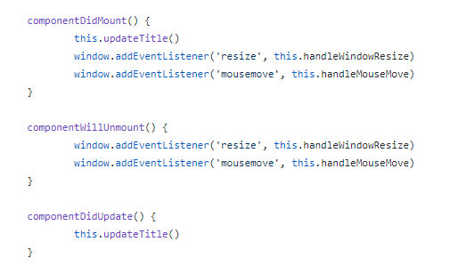
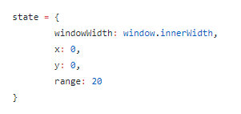
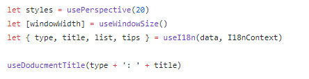

之前一直都很疑惑，React 团队一直好想一直都在提升 function 的作用，现在又加上了 `useState` 这种函数，一直不知道为什么（当然也没怎么查

今天看 工业聚 的 [进阶必读：深入理解 JavaScript 原型](https://weibo.com/ttarticle/p/show?id=2309404429772187893873#_0)  的文章中，看到有提到这个

React team 曾在 2018 年 10 月介绍 react-hooks 时，描述了 class-based component 的诸多问题。

1）许多逻辑处理都要使用生命周期方法，但它们各自只有一个，并且跟 class 声明强行绑定，难以找到有效的实现逻辑复用的途径。

2）状态存储必须集中在一个 state 中进行管理，不易拆分。

生命周期声明和数据状态当然得 class 绑定，这正是 class 作为对象创建的模板，将对象包含的数据和行为关联起来的职责所在。因此，从某种意义上，class-component 的问题不是一个能在 class 层面克服的问题。

使用基于函数组合的 react-hooks 模式，我们发现，原来数据和行为的关联和复用，有其它思路。

在 class-component 里，我们需要在同一个生命周期里做不同的事情，并且在不同的生命周期里协调同一件事情的不同阶段。

我们要把状态都集中在 state 中，通过隐式的 this 和 setState 方法去访问和更新状态。

在 function-component 里，我们则能将同一件事情的数据和行为封装到一个 custom hooks 里，使用时不需要再考虑协调问题，可以简单的获取数据或触发特定行为。

思考一下，react-hooks 模式如何使代码复用变得更简单，它跟 class-component 的差别是什么？

差别是，对象这个概念的瓦解——数据、行为及其关联是三个维度，它们不应被捆绑在对象中。

数据可以单独声明（useState），行为也可以单独声明（useEffect），数据和行为可以进行可选的关联（custom-hooks）。

数据可以单独组合，行为可以单独组合，组合的数据和组合的行为可以进行再度组合。

组合的维度得到了横向和纵向的自由度扩展。