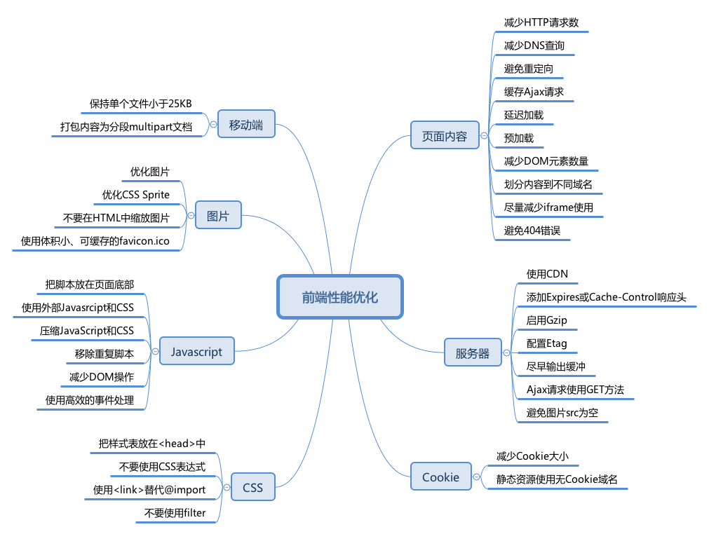

## 页面性能优化的所有指标

- FP

  > First Paing 首次绘制 

- FCP

  > First Contentful Paint 首次内容绘制

- FMP

  > First Meaningful Paing 首次

- TTI

  > Time To Interactive 开始与用户进行交互的时间

- DOMContentLoaded

- LCP

  > Largest Contentful Paint: measures loading performance. To provide a good user experience, LCP should occur within 2.5 seconds of when the page first starts loading.

- FID

  > First Input Delay: measures interactivity. To provide a good user experience, pages should have a FID of less then milliseconds.

- CLS

  > Cumulative Layout Shift: measures visual stability. To provide a good user experience, pages should maintain a CLS of less then 0.1.


## 如何性能优化

- 常见的优化手段

  - 做优化首先要有目的，即你做优化是为了什么，是把某个关键的指标提高吗？
  - 使用页面性能检测工具 insights

- 只请求当前需要的资源

  - 异步加载
  - 懒加载
  - polyfill 的优化 https://polyfill.io/v3/url-builder/ 不用在使用 webpack 编译时加载所有的 polyfill，而是选择性的加载需要的 polyfill

- 缩减资源体积

  - 打包压缩
  - 使用 gzip
  - 图片格式优化、压缩、根据屏幕分辨率展示不同分辨率的图片
  - 尽量控制 cookie 的大小

- 时序优化

  - JS 中的 Promise.all

  - 使用服务端渲染 SSR 

  - 使用 prefetch/prerender/preload

    ```html
    <link rel="dns-prefetch" href="xxx" />
    <link rel="preconnect" href="xxx" />
    <link rel="preload" as="image" href="xxx" />
    ```

- 合理使用缓存

  - 使用 CDN
  - HTTP 缓存
  - localStorage, sessionStorage

- 雅虎的35条军规

  


## 问题

- 什么是 CRP,即关键渲染路径(Critical Rendering Path)? 如何优化 ?


## 参考

- [从web-vitals到PerformanceObserver](https://juejin.im/post/6844904158076600334) 

- [First_paint](https://developer.mozilla.org/zh-CN/docs/Glossary/First_paint)

- [从 8 道面试题看浏览器渲染过程与性能优化](https://juejin.im/post/6844904040346681358)

- [Performance audits](https://web.dev/lighthouse-performance/) 

  > 使用控制台中的 lighthouse 来测试网站的性能，其中测试的 FCP/TTI 等指标的性能解析
  >
  > 还有一个是 [insights](https://developers.google.com/speed/pagespeed/insights/) 可以查看PC和mobile端各自的得分

- [Web Performance](https://developer.mozilla.org/en-US/docs/Web/Performance) 

  > MDN  中介绍关于 web performance 相关指标与解析
  
- [前端性能优化之雅虎35条军规](https://juejin.cn/post/6844903657318645767) | [雅虎原版](https://developer.yahoo.com/performance/rules.html?guccounter=1)

