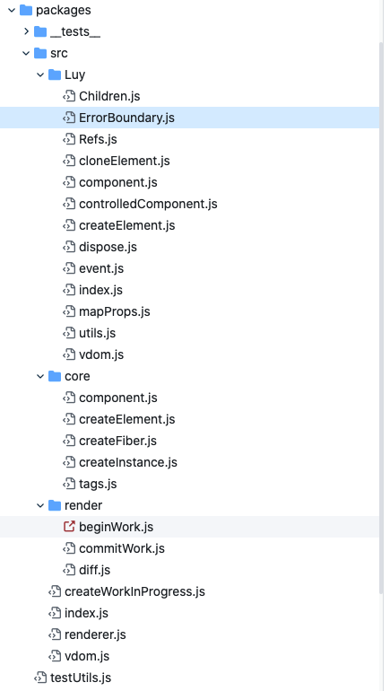

>  TODO-future，也就是以后需要做的事情的一些点

- 找一些健身的文章和视频看，自己总结
- 英语继续看张道真的，还是张满胜的更好一点，张道真的只能用来补细节，整体结构还是张满胜的好

1. 熟悉打包工作的流程

   - [简要分析前端代码从 Babel 编译到打包的流程](https://github.com/fi3ework/blog/issues/31) 

   - [roid-一个极其简单的打包软件，有非常详细的代码注释](https://github.com/Foveluy/roid) 

     > ant disign pro 中的自动插入语料，应该也是有这种类似的原理

2. 熟悉 React的一些细节

   - [一个类 React 框架](https://github.com/Foveluy/Luy)

     

       
看了一下源码的目录架构，都是React需要做的一些细节，自己的基础可以通过研读这些细节加强

       
   

3. 熟悉一个 state manage 如何来写

   - [rectx](https://github.com/Foveluy/rectx) 

     如果自己来写，应该会是什么样的
   
4. creat-react-app 的原理

5. 把基础打好，研究一下 [react-component](https://github.com/react-component) 这里面所有的组件

   > 感觉如果能够研究完，基础应该能够提升很大一部分的

---

- 熟练使用 sketch
  - 日常写技术文章需要画图，sketch 是比较好的画图工具，使用工具比使用 processon.com/draw.io 这种在线画图的更方便也更稳定