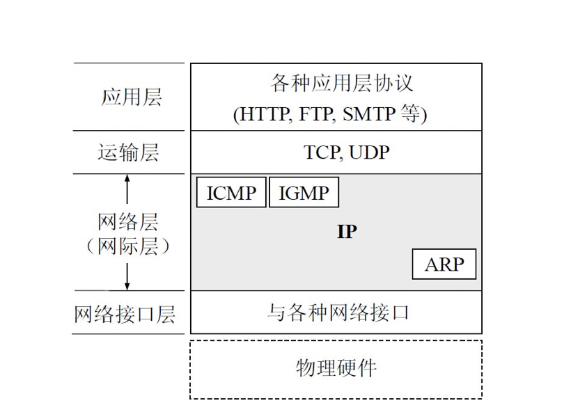
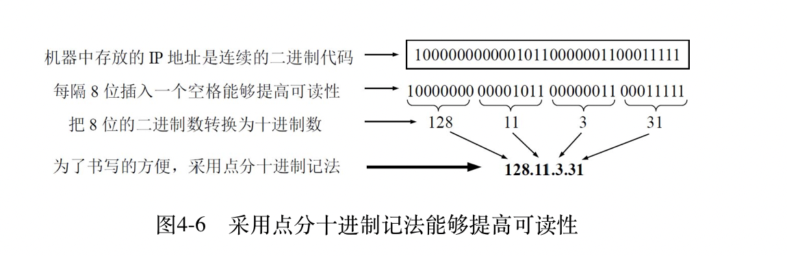
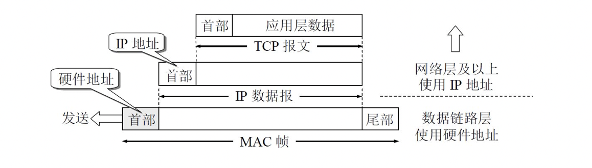
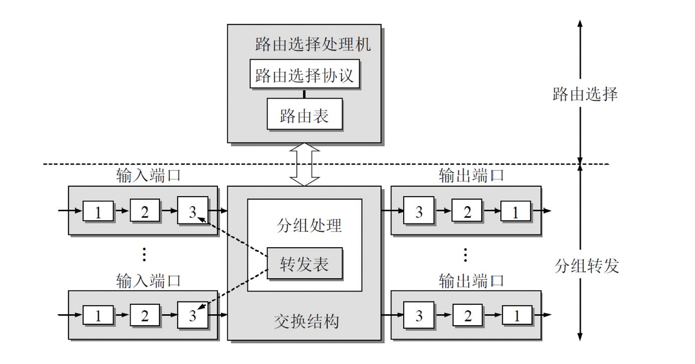

- http 就是日常使用的传输

  - 通过链接请求，然后三次握手建立了请求

  - http 包含了请求头和请求主体，这些请求头都可以从 Chrome 的network 中看到，请求主体就是数据，在使用加密的时候，请求头不会加密，请求主体会被加密

    > 这种是在 图解 HTTP 中看到的

- TCP  

  - TCP 就是用来传输的 啊，通过IP 找到了对方的地址，这下不就可以使用 TCP  来传输了

  - 所以现在知道了为什么 TCP/UDP  是在运输层了吧

    > **面向流的处理** ：TCP以流的方式处理数据。换句话说，TCP可以一个字节一个字节地接收数据，而不是一次接收一个预定义格式的数据块。TCP把接收到的数据组成长度不定的段，再传递到网际层。
    >
    > **重新排序** ：如果数据以错误的顺序到达目的，TCP模块能够对数据重新排序来恢复原始顺序。
    >
    > **流量控制** ：TCP的流量控制特性能够确保数据传输不会超过目的计算机接收数据的能力。由于现实世界里会有各种不同的应用环境，处理器速度和缓存区大小的差别也可能很大，所以这种流控制能力是非常重要的。
    >
    > 来自 《TCP/IP 入门经典》

- IP 

  - IP 就是用来找到这个地址啊

  - 就是 IP 地址啊，通过这个 IP 地址来找到其他的IP 地址啊

  - IP 这一层包含了很多协议，所以称为网际层，而不是 IP 层

    - **地址解析协议ARP** （Address Resolution Protocol）

      > 已经知道了一个机器（主机或路由器）的IP地址，需要找出其相应的硬件地址。地址解析协议ARP就是用来解决这样的问题的
      >
      > 由于是IP协议使用了ARP协议，因此通常就把ARP协议划归网络层。但ARP协议的用途是为了从网络层使用的IP地址，解析出在数据链路层使用的硬件地址。因此，有的教科书就按照协议的所用，把ARP协议划归在数据链路层。这样做当然也是可以的。

    - **网际控制报文协议ICMP** （Internet Control Message Protocol）

    - **网际组管理协议IGMP** （Internet Group Management Protocol）

  

  整个的互联网就是一个**单一的、抽象的网络** 。IP地址就是给互联网上的每一台主机（或路由器）的每一个接口分配一个在全世界范围内是唯一的32位的标识符。IP地址的结构使我们可以在互联网上很方便地进行寻址。IP地址现在由**互联网名字和数字分配机构ICANN** （Internet Corporation for Assigned Names and Numbers）进行分配 。

  IP地址的编址方法共经过了三个历史阶段。

  （1）**分类的IP地址** 。这是最基本的编址方法，在1981年就通过了相应的标准协议。

  （2）**子网的划分** 。这是对最基本的编址方法的改进，其标准RFC 950在1985年通过。

  （3）**构成超网** 。这是比较新的无分类编址方法。1993年提出后很快就得到推广应用。

  

  对主机或路由器来说，IP地址都是32位的二进制代码。为了提高可读性，我们常常把32位的IP地址中的每8位插入一个空格（**但在机器中并没有这样的空格** ）。为了便于书写，可用其等效的十进制数字表示，并且在这些数字之间加上一个点。这就叫做**点分十进制记法** （dotted decimal notation）。图4-6是一个B类IP地址的表示方法。显然，128.11.3.31比10000000 00001011 00000011 00011111书写起来要方便得多。

  

从层次的角度看，**物理地址是数据链路层和物理层使用的地址** ，而IP**地址是网络层和以上各层使用的地址，是一种逻辑地址** （称IP地址为逻辑地址是因为IP地址是用软件实现的）。

图4-8　IP地址与硬件地址的区别

在发送数据时，数据从高层下到低层，然后才到通信链路上传输。使用IP地址的IP数据报一旦交给了数据链路层，就被封装成MAC帧了。MAC帧在传送时使用的源地址和目的地址都是硬件地址，这两个硬件地址都写在MAC帧的首部中。

连接在通信链路上的设备（主机或路由器）在收到MAC帧时，根据MAC帧首部中的硬件地址决定收下或丢弃。只有在剥去MAC帧的首部和尾部后把MAC层的数据上交给网络层后，网络层才能在IP数据报的首部中找到源IP地址和目的IP地址。

总之，IP地址放在IP数据报的首部，而硬件地址则放在MAC帧的首部。在网络层和网络层以上使用的是IP地址，而数据链路层及以下使用的是硬件地址。在图4-8中，当IP数据报放入数据链路层的MAC帧中以后，整个的IP数据报就成为MAC帧的数据，因而在数据链路层看不见数据报的IP地址。

路由器是一种具有多个输入端口和多个输出端口的专用计算机，其任务是转发分组。从路由器某个输入端口收到的分组，按照分组要去的目的地（即目的网络），把该分组从路由器的某个合适的输出端口转发给下一跳路由器。下一跳路由器也按照这种方法处理分组，直到该分组到达终点为止。路由器的转发分组正是网络层的主要工作。图4-42给出了一种典型的路由器的构成框图。

整个的路由器结构可划分为两大部分：**路由选择** 部分和**分组转发部分** 

再往下就是 MAC 地址啊，MAC 地址就是硬件的，其实每个联网的设备在生成的时候都要购买一个编码，到时候这个编码才可以上网联通

> 参考 《计算机网络》第七版 数据链路层 

可以看下 《计算机网络》第七版了，这里面比较详细的介绍了 物理层、数据链路层、网络层、运输层、应用层

> 要了解网络的传输，看这本确实比较好，把网络层和运输层看一下，就能长进很多。

分层时应注意使每一层的功能非常明确。若层数太少，就会使每一层的协议太复杂。但层数太多又会在描述和综合各层功能的系统工程任务时遇到较多的困难。通常各层所要完成的功能主要有以下一些（可以只包括一种，也可以包括多种）：

①**差错控制** 使相应层次对等方的通信更加可靠。

②**流量控制** 发送端的发送速率必须使接收端来得及接收，不要太快。

③**分段和重装** 发送端将要发送的数据块划分为更小的单位，在接收端将其还原。

④**复用和分用** 发送端几个高层会话复用一条低层的连接，在接收端再进行分用。

⑤**连接建立和释放** 交换数据前先建立一条逻辑连接，数据传送结束后释放连接。

分层当然也有一些缺点，例如，有些功能会在不同的层次中重复出现，因而产生了额外开销。

**计算机网络的各层及其协议的集合** 就是网络的**体系结构** （architecture）

**数据链路层** （data link layer）

数据链路层常简称为**链路层** 。我们知道，两台主机之间的数据传输，总是在一段一段的链路上传送的，这就需要使用专门的链路层的协议。在两个相邻结点之间传送数据时，数据链路层将网络层交下来的IP数据报**组装成帧** （framing），在两个相邻结点间的链路上传送**帧** （frame）。每一帧包括数据和必要的**控制信息** （如同步信息、地址信息、差错控制等）。

在接收数据时，控制信息使接收端能够知道一个帧从哪个比特开始和到哪个比特结束。这样，数据链路层在收到一个帧后，就可从中提取出数据部分，上交给网络层。

控制信息还使接收端能够检测到所收到的帧中有无差错。如发现有差错，数据链路层就简单地丢弃这个出了差错的帧，以免继续在网络中传送下去白白浪费网络资源。如果需要改正数据在数据链路层传输时出现的差错（这就是说，数据链路层不仅要检错，而且要纠错），那么就要采用可靠传输协议来纠正出现的差错。这种方法会使数据链路层的协议复杂些。

**物理层** （physical layer）

在物理层上所传数据的单位是**比特** 。发送方发送1（或0）时，接收方应当收到1（或0）而不是0（或1）。因此物理层要考虑用多大的电压代表“1”或“0”，以及接收方如何识别出发送方所发送的比特。物理层还要确定连接电缆的插头应当有多少根引脚以及各引脚应如何连接。当然，解释比特代表的意思，就不是物理层的任务。请注意，传递信息所利用的一些物理媒体，如双绞线、同轴电缆、光缆、无线信道等，并不在物理层协议之内而是在物理层协议的下面。因此也有人把物理层下面的物理媒体当作第0层。