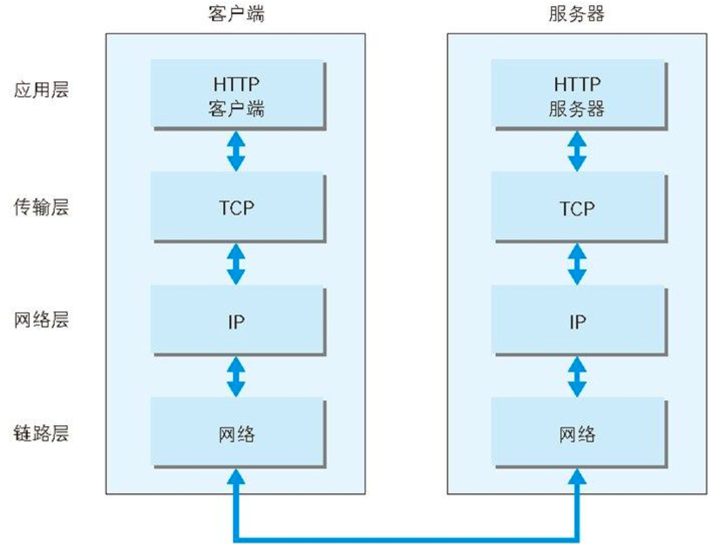
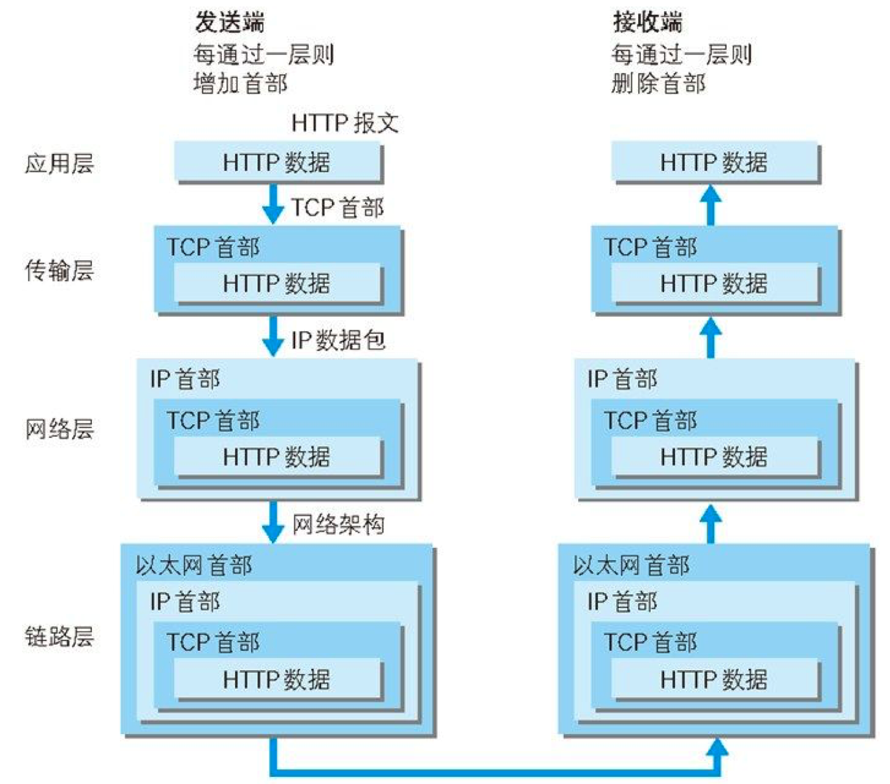
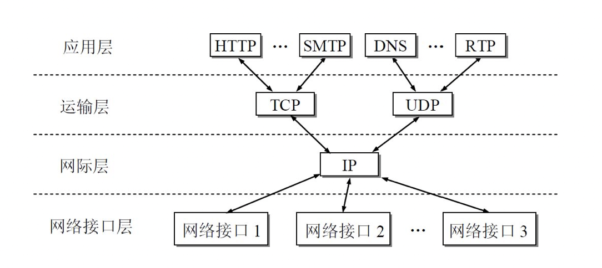
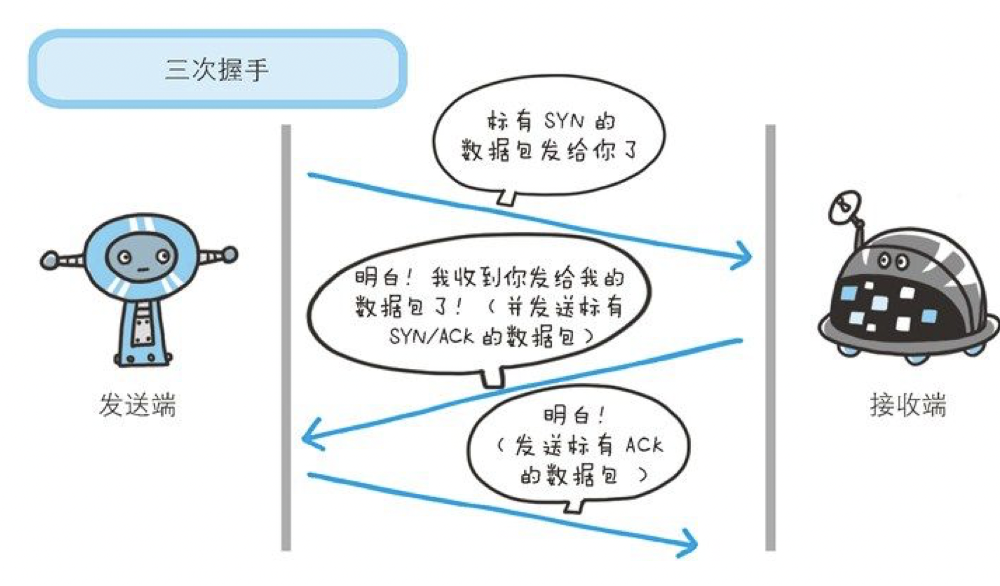
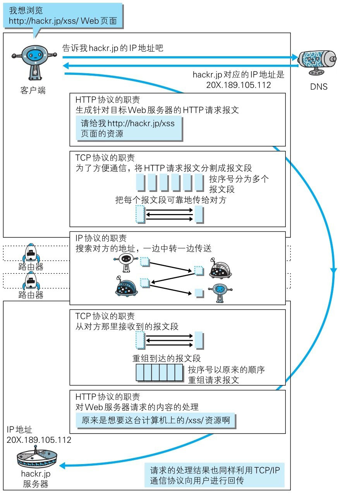

> 为了理解 HTTP，我们有必要事先了解一下 TCP/IP 协议族。
>
> 通常使用的网络（包括互联网）是在 TCP/IP 协议族的基础上运作的。而 HTTP 属于它内部的一个子集。
>
> 计算机与网络设备要相互通信，双方就必须基于相同的方法。比如，如何探测到通信目标、由哪一边先发起通信、使用哪种语言进行通信、怎样结束通信等规则都需要事先确定。不同的硬件、操作系统之间的通信，所有的这一切都需要一种规则。而我们就把这种规则称为协议（protocol）。

 如上图  **TCP/IP 是互联网相关的各类协议族的总称**

像这样把与互联网相关联的协议集合起来总称为 TCP/IP。也有说法认为，TCP/IP 是指 TCP 和 IP 这两种协议。还有一种说法认为，TCP/ IP 是在 IP 协议的通信过程中，使用到的协议族的统称。

TCP/IP 协议族里重要的一点就是分层。TCP/IP 协议族按层次分别分为以下 4 层：应用层、传输层、网络层和数据链路层。

发送端在层与层之间传输数据时，每经过一层时必定会被打上一个该层所属的首部信息。反之，接收端在层与层传输数据时，每经过一层时会把对应的首部消去。

这种把数据信息包装起来的做法称为封装（encapsulate）。

（TCP/IP 协议是只有四层的）

## 与 HTTP 关系密切的协议 : IP、TCP 和 DNS

下面我们分别针对在 TCP/IP 协议族中与 HTTP 密不可分的 3 个协议（IP、TCP 和 DNS）进行说明。

- ### **负责传输的 IP 协议**

按层次分，IP（Internet Protocol）网际协议位于网络层。Internet Protocol 这个名称可能听起来有点夸张，但事实正是如此，因为几乎所有使用网络的系统都会用到 IP 协议。TCP/IP 协议族中的 IP 指的就是网际协议，协议名称中占据了一半位置，其重要性可见一斑。可能有人会把“IP”和“IP 地址”搞混，“IP”其实是一种协议的名称。

IP 协议的作用是把各种数据包传送给对方。而要保证确实传送到对方那里，则需要满足各类条件。其中两个重要的条件是 IP 地址和 MAC 地址（Media Access Control Address）。

IP 地址指明了节点被分配到的地址，MAC 地址是指网卡所属的固定地址。IP 地址可以和 MAC 地址进行配对。IP 地址可变换，但 MAC 地址基本上不会更改。

**使用 ARP 协议凭借 MAC 地址进行通信**

IP 间的通信依赖 MAC 地址。在网络上，通信的双方在同一局域网（LAN）内的情况是很少的，通常是经过多台计算机和网络设备中转才能连接到对方。而在进行中转时，会利用下一站中转设备的 MAC 地址来搜索下一个中转目标。这时，会采用 ARP 协议（Address Resolution Protocol）。ARP 是一种用以解析地址的协议，根据通信方的 IP 地址就可以反查出对应的 MAC 地址。

TCP/IP 中的网络层负责为分组交换网上的不同**主机** 提供通信服务。在发送数据时，网络层把运输层产生的报文段或用户数据报封装成**分组** 或**包** 进行传送。在TCP/IP体系中，由于网络层使用IP协议，因此分组也叫做**IP数据报** ，或简称为**数据报** 。**本书把“分组”和“数据报”作为同义词使用** 。

网络层的另一个任务就是要选择合适的路由，使源主机运输层所传下来的分组，能够通过网络中的路由器找到目的主机。

- ### **确保可靠性的 TCP 协议**

按层次分，TCP 位于传输层，提供可靠的字节流服务。

所谓的字节流服务（Byte Stream Service）是指，为了方便传输，将大块数据分割成以报文段（segment）为单位的数据包进行管理。而可靠的传输服务是指，能够把数据准确可靠地传给对方。一言以蔽之，TCP 协议为了更容易传送大数据才把数据分割，而且 TCP 协议能够确认数据最终是否送达到对方。

**确保数据能到达目标**

为了准确无误地将数据送达目标处，TCP 协议采用了三次握手（three-way handshaking）策略。用 TCP 协议把数据包送出去后，TCP 不会对传送后的情况置之不理，它一定会向对方确认是否成功送达。握手过程中使用了 TCP 的标志（flag） —— SYN（synchronize） 和 ACK（acknowledgement）。

发送端首先发送一个带 SYN 标志的数据包给对方。接收端收到后，回传一个带有 SYN/ACK 标志的数据包以示传达确认信息。最后，发送端再回传一个带 ACK 标志的数据包，代表“握手”结束。

若在握手过程中某个阶段莫名中断，TCP 协议会再次以相同的顺序发送相同的数据包。

- ### **负责域名解析的 DNS 服务**

DNS（Domain Name System）服务是和 HTTP 协议一样位于应用层的协议。它提供域名到 IP 地址之间的解析服务。

计算机既可以被赋予 IP 地址，也可以被赋予主机名和域名。比如 [www.hackr.jp](http://www.hackr.jp/) 。

用户通常使用主机名或域名来访问对方的计算机，而不是直接通过 IP 地址访问。因为与 IP 地址的一组纯数字相比，用字母配合数字的表示形式来指定计算机名更符合人类的记忆习惯。

但要让计算机去理解名称，相对而言就变得困难了。因为计算机更擅长处理一长串数字。

为了解决上述的问题，DNS 服务应运而生。DNS 协议提供通过域名查找 IP 地址，或逆向从 IP 地址反查域名的服务。

