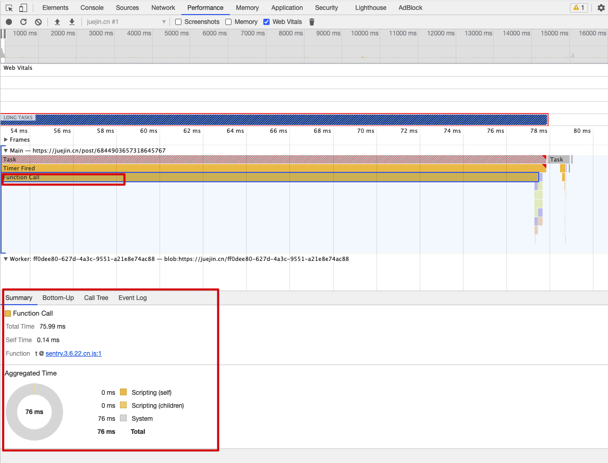
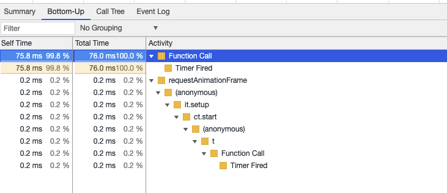
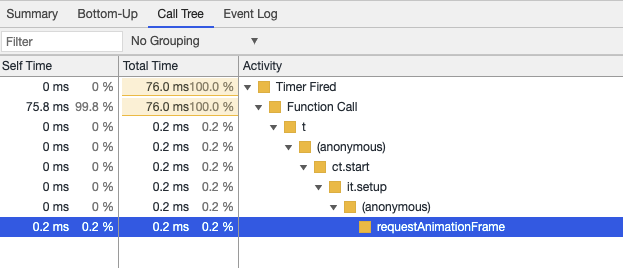

## 使用浏览器自带的控制台

- 打开 Performance，点击记录，然后就可以查看结果，比如如下图

  就能看到是哪个文件执行的时长

  


bottom-up 又可以看到那个函数执行的



call tree 里看到函数的调用



## 使用代码的方式

如果一段JS执行时间非常长，怎么去分析？

```js
// 使用 ES 的 decorator 函数
function measure(target: any, name: string, descriptor: any) {
  const oldValue = descriptor.value;

  descriptor.value = async function() {
    console.time(name);
    const ret = await oldValue.apply(this, arguments);
    console.timeEnd(name);
    return ret;
  }

  return descriptor;
}

// 测试：这里通过给 created 函数加上 @measure 函数来测试 created 的执行时间
class Home {
  public longTimefn() {
    return new Promise((resolve) => setTimeout(resolve, 4000));
  }
  
  @measure
  public async created() {
    await this.longTimefn();
  }
}
```

