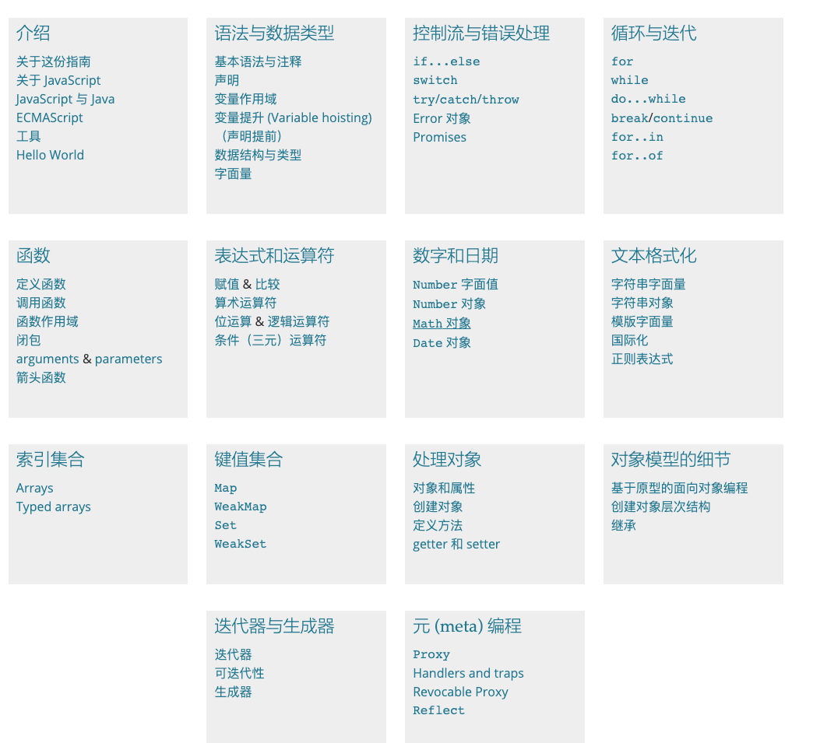

如果来让你来设计面试题，那么在针对 JS 需要考核的重点知识有哪些？

如何考察基础知识，如何考察重点知识，如何考察进阶知识

针对考察的来源，可以通过 JS 的重点书籍来理清

> 理清 JS 能做什么，
>
> 能操作DOM，
>
> 有多个数据类型能够操作数据，
>
> 有异步机制实现多进程
>
> 能够使用 ajax 实现请求
>
> 操作存储 localStorage 

下面这些是JavaScript这一门语言作为变成语言来说的基本特性，基本上所有的语言都会有这些特性，比如语法。函数、控制流等等这些

那么下面这些，就是JavaScript这门语言自己本身的特性

同时参考 https://github.com/Troland/how-javascript-works 

- 作用域
- This 
- 原型链
- 异步
- 事件循环
- 

基于任务来自己编写，其实会非常有利于自己提高能力的

通过这样一个一个小的任务，来达到自己增强对于 dom、动画、JS 编写的熟练度

自己去完成一个组件库，也是非常能够提升自己的能力的，还是得写啊

- 实现一个动画的轮播图，看 winter 的进阶课中这样写，自己跟着写一遍，是非常能够提升我的能力的
- 滴滴车联网一面时的一个题，在浏览器中的四个角不间断的产生气泡，然后移动到对角线的那个角，然后消失
- 

