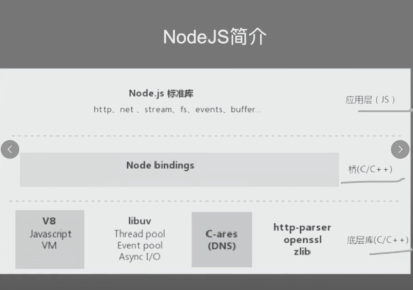
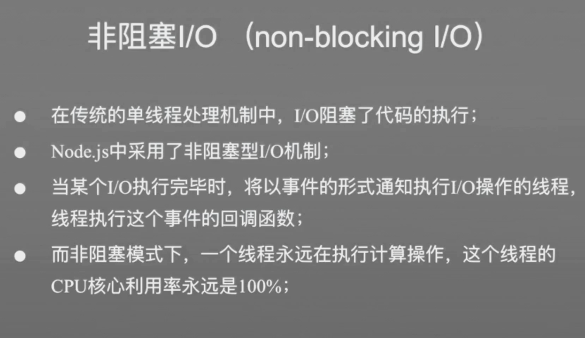
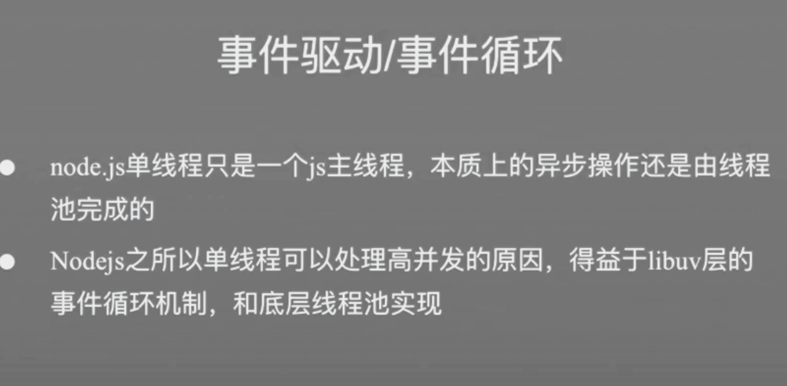

Node 的高性能体现在

> Node 与Redis 和 Nginx 都非常像
>
> 以下几点总的概括来说，就是Node 中有个主线程，然后请求过来之后，会添加到队列中，调用线程池中的线程，来将队列中的任务通过事件循环的方式来处理

- 不像传统后端一样，每次有请求过来需要单独分配一个线程来进行运行，Node 只有一个主线程来处理所有客户端发送过来的请求 
  - 单线程指的是主线程，Node 中有个线程池，每次会通过主线程来在线程池来处理一些任务，如IO处理，网络请求
  - 主线程不会处理具体的事务，都是通过调用线程池中的线程来处理
  - 有个队列，每次都是将相应的请求放到队列中，然后使用线程池中的线程来处理
  - 因为主线程是单线程，所以在主线程中不能被阻塞，一旦被阻塞，就会影响后续的运行
- Node 的事件驱动，当某个事件触发了，就触发一个对应的事件来执行
- 依靠事件循环机制来对请求进行处理
- 有大量的异步回调处理，通过将异步任务添加到队列中，来进行不同任务的处理

- Node.js 单线程实现高并发原理
  - 单线程
  - 非阻塞I/O (no-blocking I/O)
  - 事件驱动/事件循环
- Node.js 适用场景

## 参考

- [NodeJS实现高并发的原理](https://www.bilibili.com/video/BV1P441157wx)
- [圣思园 - Node深入浅出](https://www.bilibili.com/video/BV12V411k7KE)

