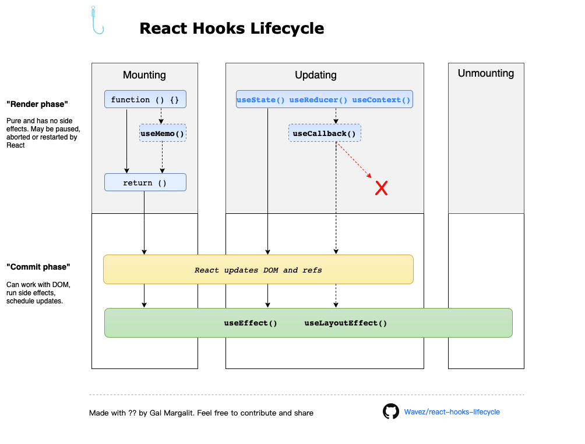
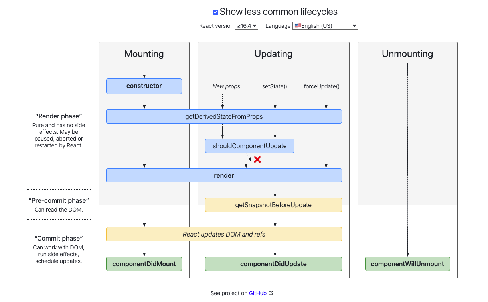

## getDerivedStateFromProps

- 触发时间(v16.4修正)：组件每次被rerender的时候，包括在组件构建之后(render之前最后执行)，每次获取新的props或state之后。在v16.3版本时，组件state的更新不会触发该生命周期。
- 每次接收新的props之后都会返回一个对象作为新的state，返回null则说明不需要更新state.
- 配合 `componentDidUpdate`，可以覆盖`componentWillReceiveProps` 的所有用法

```js
class Example extends React.Component {
  static getDerivedStateFromProps(nextProps, prevState) {
    // 没错，这是一个static
  }
}
```

- 从 16.3 版本开始，当 `props` 变化时，建议使用新的 `static getDerivedStateFromProps` 生命周期更新 `state`。创建组件以及每次组件由于 props 或 state 的改变而重新渲染时都会调用该生命周期：

- 你可能想知道为什么我们不将上一个 props 作为参数传递给 `getDerivedStateFromProps`。我们在设计 API 时考虑过这个方案，但最终决定不采用它，原因有两个：
  - `prevProps` 参数在第一次调用 `getDerivedStateFromProps`（实例化之后）时为 null，需要在每次访问 `prevProps` 时添加 if-not-null 检查。
  - 在 React 的未来版本中，不传递上一个 props 给这个方法是为了释放内存。（如果 React 无需传递上一个 props 给生命周期，那么它就无需保存上一个 `props` 对象在内存中。）

## componentwillmount

- 不推荐在 componentwillmount 里最获取数据的操作呢

  - [关于React v16.3 新生命周期](https://juejin.im/post/5aca20c96fb9a028d700e1ce)

    有一种错觉，在componentWillMount请求的数据在render就能拿到，但其实render在willMount之后几乎是马上就被调用，根本等不到数据回来，同样需要render一次“加载中”的空数据状态，所以在didMount去取数据几乎不会产生影响。

  - [全面了解 React 新功能: Suspense 和 Hooks](https://segmentfault.com/a/1190000017483690)

    有了Fiber 之后， react 的渲染过程不再是一旦开始就不能终止的模式了， 而是划分成为了两个过程： 第一阶段和第二阶段， 也就是官网所谓的 `render phase` and `commit phase`。

    在 Render phase 中, React Fiber会找出需要更新哪些DOM，这个阶段是可以被打断的， 而到了第二阶段commit phase， 就一鼓作气把DOM更新完，绝不会被打断。

    **两个阶段的分界点** 

    这两个阶段， `分界点`是什么呢？

    其实是 `render 函数`。 而且， `render 函数 也是属于 第一阶段 render phase 的`。

    那这两个 phase 包含的的生命周期函数有哪些呢？

    `render phase`:

    - componentWillMount
    - componentWillReceiveProps
    - shouldComponentUpdate
    - componentWillUpdate

    `commit phase`:

    - componentDidMount
    - componentDidUpdate
    - componentWillUnmount

    综上也就是在 `componentWillMount` 中有可能被打断，导致后续需要重新进入，会进行多次的调用
    
  - [官方文档](https://zh-hans.reactjs.org/blog/2018/03/27/update-on-async-rendering.html) 

    有一个常见的误解是，在 `componentWillMount` 中获取数据可以避免第一次渲染为空的状态。实际上，这是不对的，因为 React 总是在 `componentWillMount` 之后立即执行 `render`。如果在 `componentWillMount` 触发时数据不可用，那么第一次 `render` 仍然会显示加载的状态，而不管你在哪里初始化获取数据。这就是为什么在绝大多数情况下，将获取数据移到 `componentDidMount` 没有明显效果的原因。


## componentDidMount

- 在componentDidMount中添加事件监听
  
  react只能保证componentDidMount-componentWillUnmount成对出现，componentWillMount可以被打断或调用多次，因此无法保证事件监听能在unmount的时候被成功卸载，可能会引起内存泄露
  
- pureComponent 好在哪？ 
  
  不应等是 pureComponent 里面会自动对比之前的 prevProps 和 nextProps 吗，然后再决定是否更新，但是在 [PureComponent的作用及一些使用陷阱](https://www.jianshu.com/p/33cda0dc316a) 中，说`shouldComponentUpdate` 会始终返回 `true` ，那还要 `PureComponent` 还有什么区别？
  
- React 新旧生命周期的不同 

  [关于React v16.3 新生命周期](https://juejin.im/post/5aca20c96fb9a028d700e1ce) 

	> 旧的生命周期十分完整，基本可以捕捉到组件更新的每一个state/props/ref，没有什从逻辑上的毛病。
	>
	> 但是架不住官方自己搞事情，react打算在17版本推出新的Async Rendering，提出一种可被打断的生命周期，而可以被打断的阶段正是实际dom挂载之前的虚拟dom构建阶段，也就是要被去掉的三个生命周期。
	>
	> 生命周期一旦被打断，下次恢复的时候又会再跑一次之前的生命周期，因此componentWillMount，componentWillReceiveProps， componentWillUpdate都不能保证只在挂载/拿到props/状态变化的时候刷新一次了，所以这三个方法被标记为不安全。

## UNSAFE_componentWillMount

- `UNSAFE_componentWillMount`

  为什么说此方法是服务端渲染唯一会调用的声明周期函数

  [文档](https://zh-hans.reactjs.org/docs/react-component.html#unsafe_componentwillmount) 

## getSnapshotBeforeUpdate

- 为什么要有`getSnapshotBeforeUpdate` ，因为这个是比较好的时间段来获取 `dom` 的信息，这时候记录之前的 `dom` 的状态，也就是更新之前`dom` 的状态，也就是更新之前不会再改了，所以更新之后与之前的 `dom` 信息对比的时候，之前的 `dom` 信息就一定是准确的

  1：在render之前调用，state已更新

  2：典型场景：获取render之前的dom状态

  - 触发时间: update发生的时候，在render之后，在组件dom渲染之前。
  - 返回一个值，作为componentDidUpdate的第三个参数。
  - 配合componentDidUpdate, 可以覆盖componentWillUpdate的所有用法。

  ```js
  class Example extends React.Component {
    getSnapshotBeforeUpdate(prevProps, prevState) {
      // ...
    }
  }
  ```

## componentDidUpdate

- 我还是没有明白，`componentDidUpdate` 要解决的是什么问题

  感觉还是在对比之前的 `props, state` 与现在的 `props, state` 之后，然后再做相应的操作，如更新之后不是所需要的，然后继续更新

  这也就是为什么`didUpdate ` 里的更新一定要放在 `if` 里面，因为如果不再 `if` 里面，那么每次都会触发更新，导致死循环

  ```js
  // shouldComponentUpdate(nextProps, nextState)
  // componentWillUpdate(nextProps, nextState)
  // getSnapshotBeforeUpdate(prevProps, prevState)
  componentDidUpdate(prevProps, prevState) {
    if (prevState.content !== this.state.content) {
      this._body && (this._body.innerHTML = this.state.content);
    }
  }
  ```

  > 找到一个[案例](https://stackoverflow.com/questions/38759703/when-to-use-react-componentdidupdate-method)了，每次更新 state 后，会触发 `componentDidUpdate` ，然后在 `componentDidUpdate` 中把新的数据使用 `ajax` 来提交到后端中。

  参照 `componentWillReceiveProps` ，这里的参数是 `nextProps`  而 `componentDidUpdate` 的是 `prevProps, prevState` 

  ```js
  componentWillReceiveProps(nextProps) {}
  ```


## componentWillReceiveProps

与 `componentWillUpdate` 类似，`componentWillReceiveProps` 可能在一次更新中被多次调用。因此，避免在此方法中产生副作用非常重要。相反，应该使用 `componentDidUpdate`，因为它保证每次更新只调用一次：

## 为何移除 componentWillUpdate

大多数开发者使用 componentWillUpdate 的场景是配合 componentDidUpdate，分别获取 rerender 前后的视图状态，进行必要的处理。但随着 React 新的 suspense、time slicing、异步渲染等机制的到来，render 过程可以被分割成多次完成，还可以被暂停甚至回溯，这**导致 componentWillUpdate 和 componentDidUpdate 执行前后可能会间隔很长时间**，足够使用户进行交互操作更改当前组件的状态，这样可能会导致难以追踪的 BUG。

React 新增的 getSnapshotBeforeUpdate 方法就是为了解决上述问题，因为 getSnapshotBeforeUpdate 方法是在 componentWillUpdate 后（如果存在的话），在 React 真正更改 DOM 前调用的，它获取到组件状态信息更加可靠。

除此之外，getSnapshotBeforeUpdate 还有一个十分明显的好处：它调用的结果会作为第三个参数传入 componentDidUpdate，避免了 componentWillUpdate 和 componentDidUpdate 配合使用时将组件临时的状态数据存在组件实例上浪费内存，getSnapshotBeforeUpdate 返回的数据在 componentDidUpdate 中用完即被销毁，效率更高。


使用 hooks  | [来源](https://wavez.github.io/react-hooks-lifecycle/)




在 react >= 16.4 的生命周期图，[来源](https://projects.wojtekmaj.pl/react-lifecycle-methods-diagram/)




## 参考

- [谈谈新的 React 新的生命周期钩子](https://imweb.io/topic/5b8cacaa7cd95ea863193572)

  新增了哪些声明周期，为什么新增，为什么之前的声明周期要使用 `UNSAFE` 

- [官方文档-异步渲染之更新](https://zh-hans.reactjs.org/blog/2018/03/27/update-on-async-rendering.html)