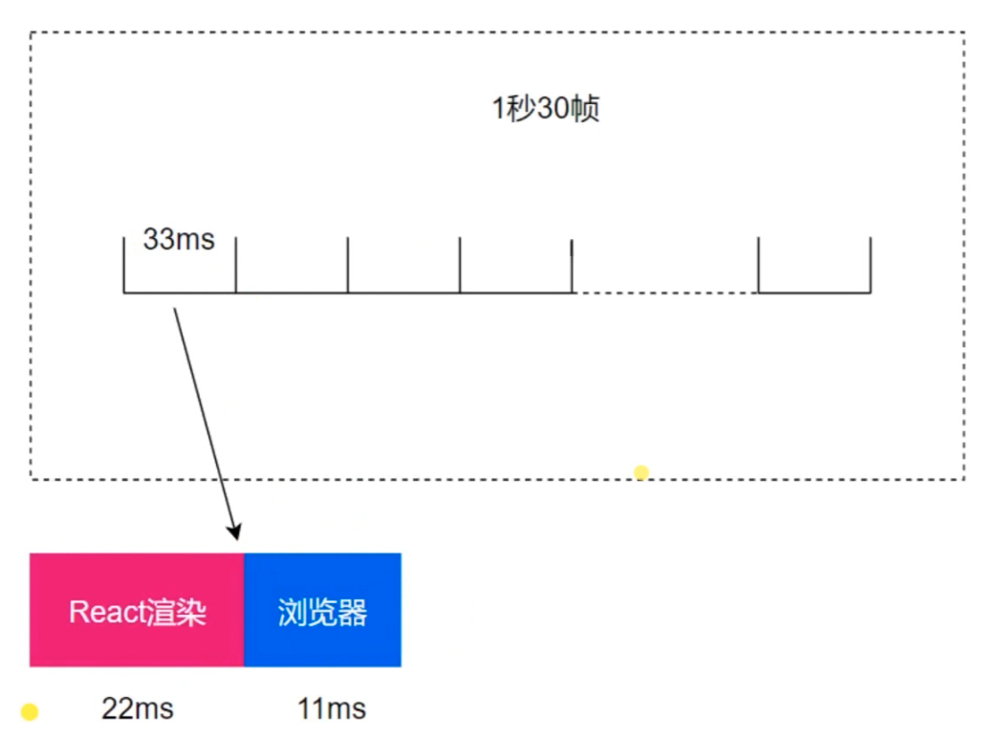
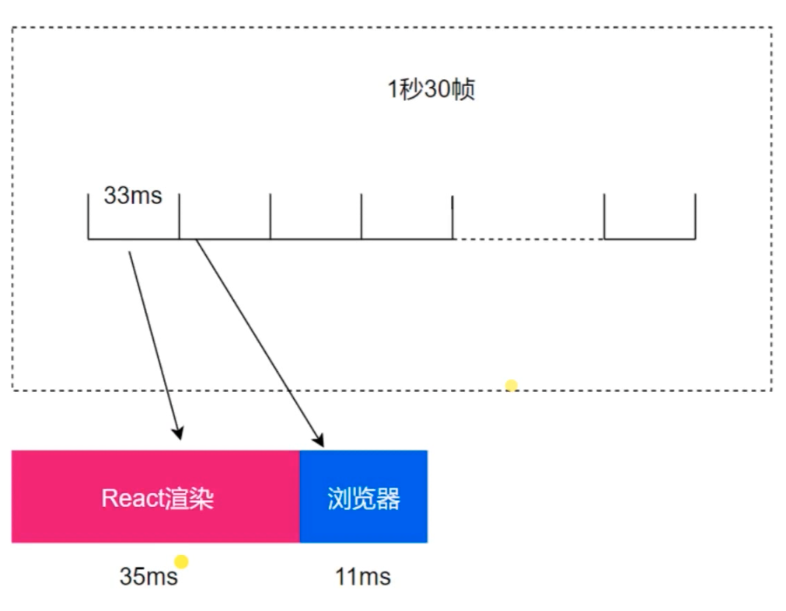

核心目标：扩大其*适用性*，包括动画，布局和手势。分为5个具体目标（后2个算送的）：

- 把可中断的工作拆分成小任务
- 对正在做的工作调整优先次序、重做、复用上次（做了一半的）成果
- 在父子任务之间从容切换（yield back and forth），以支持React执行过程中的布局刷新
- 支持`render()`返回多个元素
- 更好地支持error boundary


Scheduler 的整体流程概览

调度过程中的各种全局变量一览

构建任务调度的概念


scheduleWork

- 找到更新对应的 FiberRoot 节点
- 如果符合条件重置 stack
- 如果符合条件就请求工作调度


requestWork

- 加入到 root 调度队列
- 判断是否批量更新
- 根据 expirationTime 判断调度类型


## batchUpdates

是在 `react-dom` 包中

有个按钮直接点击更新 count + 1，函数为 handleClick

```js
function handleClick() {
  this.setState({
    count: this.state.count++
  }) ;
  
  
}

function numberAdd() {
  this.setState({
    count: this.state.count++
  }) ;
  console.log(this.state.count);
  this.setState({
    count: this.state.count++
  }) ;
  console.log(this.state.count);
  this.setState({
    count: this.state.count++
  }) ;
}
```

## scheduler

要保证JS运行的流畅性，所以需要每一帧都需要足够的时间，正常保持流畅是需要每一帧 33ms，这一帧里面，react 渲染应用需要22ms，就一定要尽量就给浏览器11ms，这样浏览器才能有足够的动画渲染到页面中，保证给用户看到的是流畅的



但是如果JS 运行的时间超过了33ms，那么久需要借用下一帧，如下图，这样下一帧就只剩下20ms，那么如何才能保证每一帧里浏览器的时间足够渲染，保证流畅性呢，这就是 react scheduler 的作用




在 `react-16.6.0/packages/react-reconciler/src/ReactFiberScheduler.js` 中 `scheduleCallbackWithExpirationTime` 函数 

```js
callbackExpirationTime = expirationTime;
const currentMs = now() - originalStartTimeMs; // originalStartTimeMs react 应用启动时候就开始记录的时间
const expirationTimeMs = expirationTimeToMs(expirationTime); // 过期时间，也就是每次执行，都会有各有过期时间
const timeout = expirationTimeMs - currentMs;
// scheduleDeferredCallback 看名字知道是个 deferred
callbackID = scheduleDeferredCallback(performAsyncWork, {timeout});
```

看引用文件 `scheduleDefferredCallback` 

```js
import {
  now,
  scheduleDeferredCallback,
  cancelDeferredCallback,
  prepareForCommit,
  resetAfterCommit,
} from './ReactFiberHostConfig'; 虽然是从这个文件引用的，但是点击这个文件后，发现里面并没有代码

// 在 react-16.6.0/packages/react-reconciler/src/forks/ReactFiberHostConfig.dom.js 中看到
export * from 'react-dom/src/client/ReactDOMHostConfig';
// 也就是所有的代码都在  react-dom/src/client/ReactDOMHostConfig

// 进入该文件后看到
export {
  unstable_now as now,
  unstable_scheduleCallback as scheduleDeferredCallback,
  unstable_cancelCallback as cancelDeferredCallback,
} from 'scheduler';

// 在 react-16.6.0/packages/scheduler/src/Scheduler.js  中就看到 这个方法了
function unstable_scheduleCallback(callback, deprecated_options) {...}
```

解析 `unstable_scheduleCallback` 

```js
// 找到当前组件的优先级
switch (currentPriorityLevel) {
  case ImmediatePriority:
    expirationTime = startTime + IMMEDIATE_PRIORITY_TIMEOUT;
    break;
  case UserBlockingPriority:
    expirationTime = startTime + USER_BLOCKING_PRIORITY;
    break;
  case IdlePriority:
    expirationTime = startTime + IDLE_PRIORITY;
    break;
  case NormalPriority:
  default:
    expirationTime = startTime + NORMAL_PRIORITY_TIMEOUT;
}

// 创建一个新的 node
var newNode = {
    callback,
    priorityLevel: currentPriorityLevel,
    expirationTime,
    next: null,
    previous: null,
  };

// firstCallbackNode === null 也就是只有当前一个节点，react 会把所有的组件设置为一个链表的形式，这样就能够找到下一个节点了，那么在这里，就是节点的前后，都是当前的节点
// Insert the new callback into the list, ordered first by expiration, then
// by insertion. So the new callback is inserted any other callback with
// equal expiration.
if (firstCallbackNode === null) {
  // This is the first callback in the list.
  firstCallbackNode = newNode.next = newNode.previous = newNode;
  ensureHostCallbackIsScheduled();
} 
else {
  var next = null;
  var node = firstCallbackNode;
  // 循环所有的节点，根据节点的 expirationTime 来重新排序，后续需要根据最高优先级的组件节点进行更新
  do {
    if (node.expirationTime > expirationTime) {
      // The new callback expires before this one.
      next = node;
      break;
    }
    node = node.next;
  } while (node !== firstCallbackNode);

  // 只有一个节点的情况下
  if (next === null) {
    // No callback with a later expiration was found, which means the new
    // callback has the latest expiration in the list.
    next = firstCallbackNode;
  } 
  // 
  else if (next === firstCallbackNode) {
    // The new callback has the earliest expiration in the entire list.
    firstCallbackNode = newNode;
    ensureHostCallbackIsScheduled();
  }

  // 更新节点位置
  var previous = next.previous;
  previous.next = next.previous = newNode;
  newNode.next = next;
  newNode.previous = previous;
}
```

这里的 `ensureHostCallbackIsScheduled`  里重要的就是 `requestHostCallback`，  `requestHostCallback` 会判断好几种情况，是否是 `window` 环境，因为还有`native` 环境

```js
requestHostCallback = function(callback, absoluteTimeout) {
    scheduledHostCallback = callback;
    timeoutTime = absoluteTimeout;
    if (isFlushingHostCallback || absoluteTimeout < 0) {
      // Don't wait for the next frame. Continue working ASAP, in a new event.
      window.postMessage(messageKey, '*');
    } else if (!isAnimationFrameScheduled) {
      // If rAF didn't already schedule one, we need to schedule a frame.
      // TODO: If this rAF doesn't materialize because the browser throttles, we
      // might want to still have setTimeout trigger rIC as a backup to ensure
      // that we keep performing work.
      isAnimationFrameScheduled = true;
      requestAnimationFrameWithTimeout(animationTick);
    }
  };
```

`requestHostCallback` 这里通过在执行 `callback` 之后，就使用 `window.postMessage(messageKey, '*');` 就开始执行下一帧

```js
window.addEventListener('message', idleTick, false);
```

`idleTick` 就是在接收到`message`， 也就是执行完之后，就开始执行

`idleTick` 的重点也是在执行 `requestAnimationFrameWithTimeout(animationTick);` 和 `scheduledHostCallback(didTimeout);`   

```js
var requestAnimationFrameWithTimeout = function(callback) {
  // schedule rAF and also a setTimeout
  rAFID = localRequestAnimationFrame(function(timestamp) {
    // cancel the setTimeout
    localClearTimeout(rAFTimeoutID);
    callback(timestamp);
  });
  rAFTimeoutID = localSetTimeout(function() {
    // cancel the requestAnimationFrame
    localCancelAnimationFrame(rAFID);
    callback(getCurrentTime());
  }, ANIMATION_FRAME_TIMEOUT);
};
```

这里使用一个是 `localRequestAnimationFrame` 还有  `localSetTimeout` 同时执行，主要考虑的还是兼容性，如果到了`ANIMATION_FRAME_TIMEOUT` 的时间，就

`animationTick` 

```js
var animationTick = function(rafTime) {
    if (scheduledHostCallback !== null) {
      // Eagerly schedule the next animation callback at the beginning of the
      // frame. If the scheduler queue is not empty at the end of the frame, it
      // will continue flushing inside that callback. If the queue *is* empty,
      // then it will exit immediately. Posting the callback at the start of the
      // frame ensures it's fired within the earliest possible frame. If we
      // waited until the end of the frame to post the callback, we risk the
      // browser skipping a frame and not firing the callback until the frame
      // after that.
      requestAnimationFrameWithTimeout(animationTick);
    } else {
      // No pending work. Exit.
      isAnimationFrameScheduled = false;
      return;
    }

   //   var activeFrameTime = 33; 就是一帧的时长
   // 这里就是在处理，当前帧和下一帧的问题，如果当前帧超过了 33，或者小于33，下一帧该如何处理，
    var nextFrameTime = rafTime - frameDeadline + activeFrameTime;
    if (
      nextFrameTime < activeFrameTime &&
      previousFrameTime < activeFrameTime
    ) {
      if (nextFrameTime < 8) {
        // Defensive coding. We don't support higher frame rates than 120hz.
        // If the calculated frame time gets lower than 8, it is probably a bug.
        nextFrameTime = 8;
      }
      // If one frame goes long, then the next one can be short to catch up.
      // If two frames are short in a row, then that's an indication that we
      // actually have a higher frame rate than what we're currently optimizing.
      // We adjust our heuristic dynamically accordingly. For example, if we're
      // running on 120hz display or 90hz VR display.
      // Take the max of the two in case one of them was an anomaly due to
      // missed frame deadlines.
      activeFrameTime =
        nextFrameTime < previousFrameTime ? previousFrameTime : nextFrameTime;
    } else {
      previousFrameTime = nextFrameTime;
    }
    frameDeadline = rafTime + activeFrameTime;
    if (!isMessageEventScheduled) {
      isMessageEventScheduled = true;
      window.postMessage(messageKey, '*');
    }
  };
```


## performWork

- 是否有 deadline 的区分
- 循环渲染 root 的条件
- 超过时间片的处理

# renderRoot

- 调用 workLoop 进行循环单元更新
- 捕获错误并进行处理
- 走完流程之后进行善后

renderRoot 对每一个 fiber 进行更新，循环每个节点，更新每个节点，如果有错误，就捕获进行处理，也就是 didCatch ，

## 参考文档

- [探索 React 的内在 — Fiber & Algebraic Effects](https://mp.weixin.qq.com/s/7MQp1CrZFwNd4dQ3y2C-UA)

- [React Fiber 架构学习](https://zhuanlan.zhihu.com/p/44942360)

- [完全理解React Fiber](http://www.ayqy.net/blog/dive-into-react-fiber/)
- [React16源码之React Fiber架构](https://github.com/HuJiaoHJ/blog/issues/7#)
- [React系列——React Fiber 架构介绍资料汇总（翻译+中文资料）](https://segmentfault.com/a/1190000012834204) 