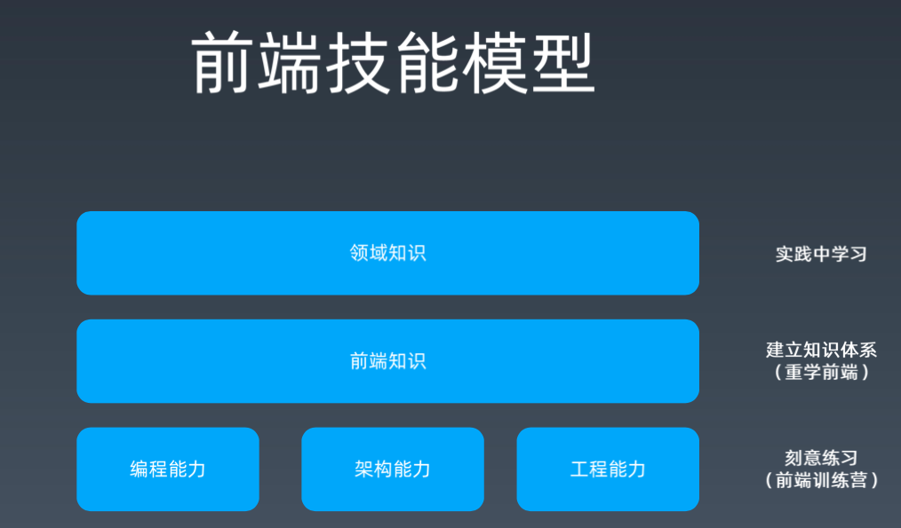
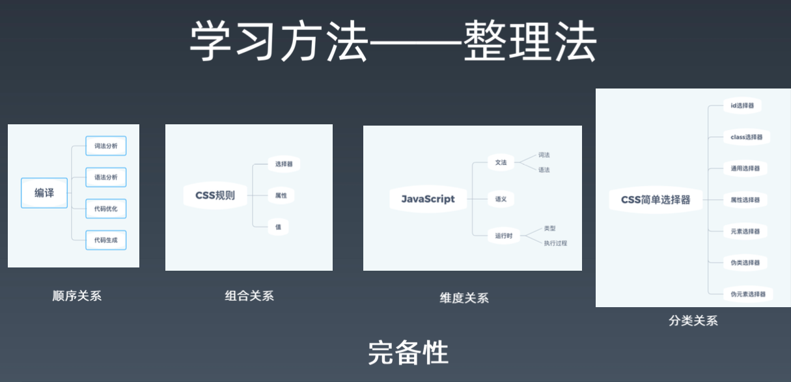

- 编程能力解决难的问题
  - 刻意练习，写 demo，写一些核心的要点，有时间就要多去练
- 架构能力解决大的问题，就是你可以实现某一块的能力，但是在架构方面，你需要解决所有的问题
  - 读源代码，看开源项目
  - 大部分都是平时看别人的项目，带着目的去读，看看issue，然后修一些 bug
- 工程能力解决人的问题，把人组织起来
  - 比如有人使用代码行数，千行bug数来管理，就是工程能力不行
  - 

