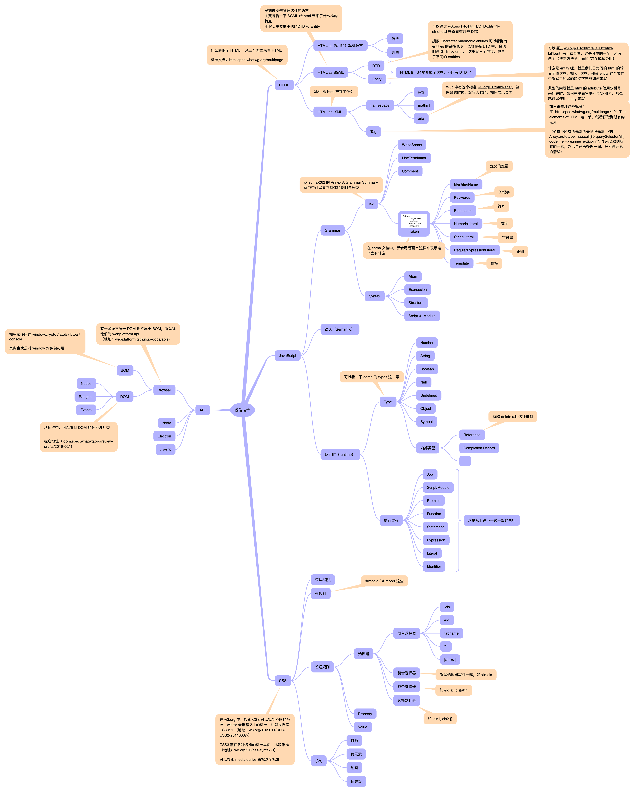

这节课的作业就是把上节课的预习作业写了

- 从 ecma-international.org 中下载 ecma 的标准

- whatwg.org 中找 html 的标准
  - https://html.spec.whatwg.org/multipage/#toc-syntax
- w3.org/TR/?tag=css&status=wd 中找 css 的标准

> 就是当前文件夹下的 前端技术.itmz，使用 IThoughtX 打开

