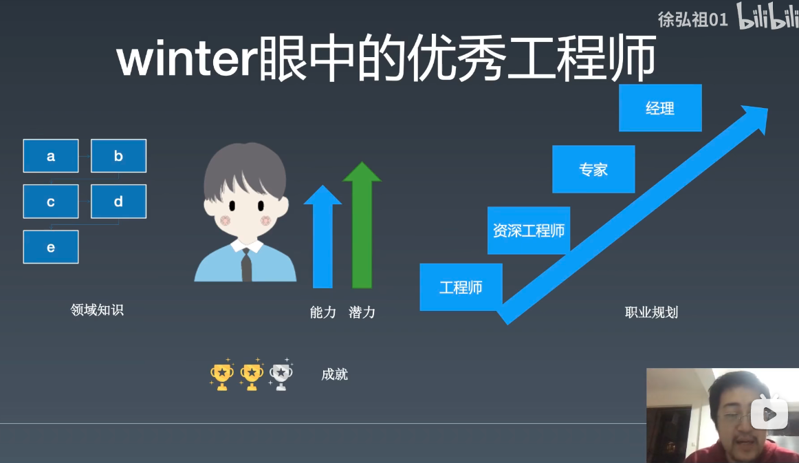

winter 在这里讲到了一个潜力的事情，就是潜力其实是看得到的，就是一个人的基础能力，就是前期一个人的基础打得越牢，后续就能走得越顺，要不然就只能是走到 P6 或者 P7 就到头了

一定要有职业规划，然后知道自己这几年要往哪个方向走

那么这些如何来让你的雇主知道呢？比如你的领域知识很牢固，你的能力

答案就是你做出来的成就，你的成就越显著，就越明显，比如 winter 在手机淘宝做的事情

winter 也说了当年在做淘宝其实是一个非常好的机会，就是让你做一个体量这么大的东西，只要写在简历上就几乎所有人都知道，这种机会只有后续回想起来才知道当年是多么的好

- 不是负责的整个淘宝，所以要写清楚在哪个阶段到哪个阶段做了哪些事情，哪些指标有了哪些提升，在前端方面上做了哪些事情 
- 因为说我的学习能力很强，我的基础牢固这些主观的是没法说的，你不可能把所有的API背下来，也不可能把标准背下来，所以只能探讨客观成就，就是你做出了什么东西，你所有做出来的努力，最终展现了什么
- 学习这门课程，winter 希望大家有两个成就，一个练习成就，一个是商业成就，练习成就就是跟着视频做一些代码练习，但是这个写在简历上是没什么公司会认的，就是效果不大，所以需要你在商业上有些成就，就是在公司的项目上，你做出了什么成就，这个就是认可的
- 另外你写的东西，可以公开发表，这样就会有更多人的认可，不要只在班里进行发表，只有放到公开的空间里面去，才是有价值的
- 谁才是真正为你的职业规划负责的人，是你自己，你的公司雇佣你来是让你来完成需求的，是发钱给你的，所以你需要去上课，学习视频，开源项目这些来提升自己
- 公司没让你晋升，可能是公司不需要你晋升之后这个级别的人，之前美团有个开源项目，在知乎上吐槽说上司怎么样，自己努力工作最后没有获得什么什么的，这个是职业生涯规划出现的问题，既然上司都这样了，为什么还需要来抱怨，为什么还留在这里
- 当你职业发展遇到了问题，要自己想办法如报班学习、和领导沟通、自己发起一个项目等办法来解决

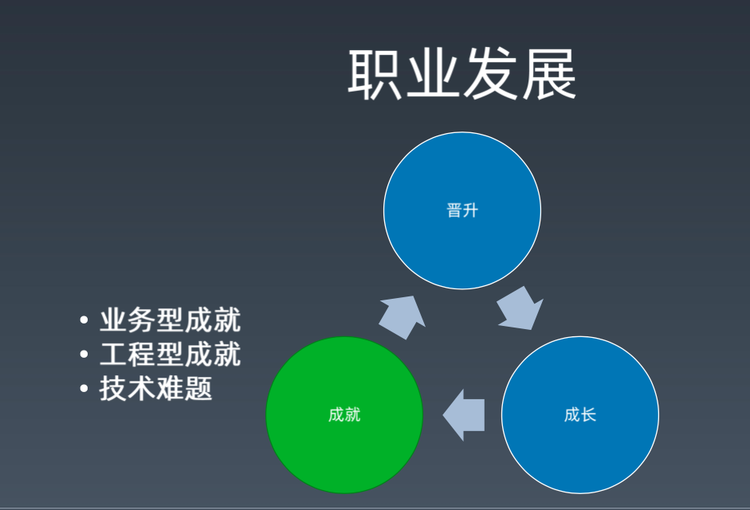

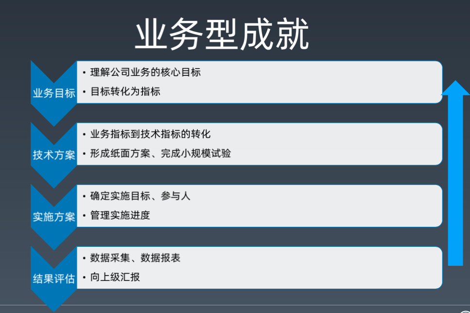

- winter 提到之前在阿里的时候，有次晋升，说是有个老黄牛，是个业务型的人才，其实在日常面试的时候，如果你说你是业务型的人才，那其实也就是你在说你的技术能力不行，如果你说你的学习能力很强，那么也就是说现在你技术能力不行

  晋升的时候，就问了那个人是那么你的业务的核心 KPI 是什么，结果那个人就蒙了，不知道怎么回答

  如果你是专注于做业务的，那么你就需要知道公司核心赚钱的KPI 是什么，比如阿里之前是流量、转化率、客单价等几个目标，那么你在这几个目标上，有任何一个目标做到了提升，那么谁都不会有什么意见，那么全公司的资源都能去帮你

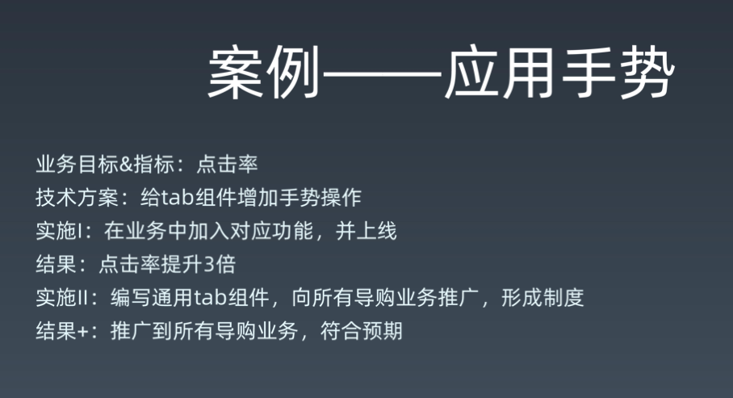

- winter 提到了在阿里的一个案例，就是有个小伙，将 tab 页的点击操作加上了手势的左右滑动操作，导致点击率提升了 3 倍，这时候产品经理过来和winter 说要好好表扬这个小伙，然后 winter 和这个小伙说你要好好表现，封装一下这个组件推广到其他业务线来使用，这样导购的很多业务的点击率都上去了，一下子就完成了很多的KPI

- 这个组件不是这个小伙原创的，但是这种业务的敏感，让他得到了展示的机会，所以带来了回报

- 这种在技术上没有什么难度，但是在业务上有很大的提升

- 这种不是随便蒙的，而是需要你对业务需要有敏感度，也就是需要有产品sense 

- 有人说要是领导不认怎么办，不让你这么做

  - winter 说领导不认，你还可以写在简历上 

  - 你是否能够持续的产出这种东西，如果是蒙的，那么当然就只能是运气了

    （所以搞技术的，也是同样需要产品sense的，也是需要多研究产品的

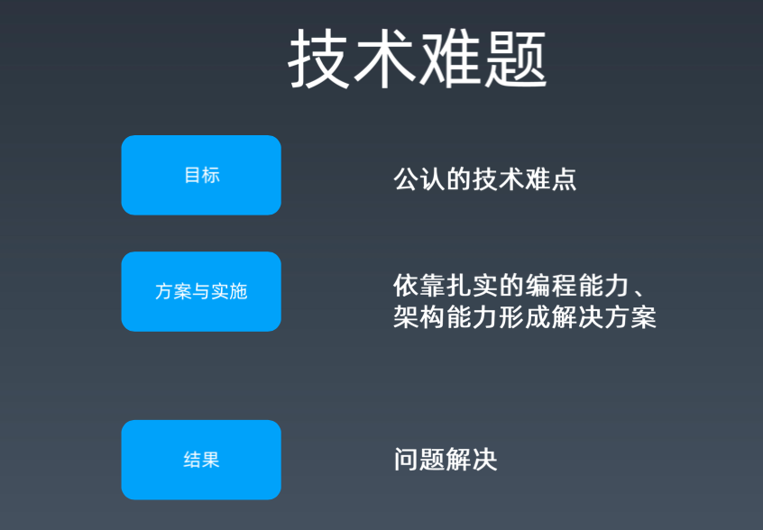

- 比如你要解决一个难题，那么这个难题就是一个业界公认的难题，大家都觉得这个难题不好解决  

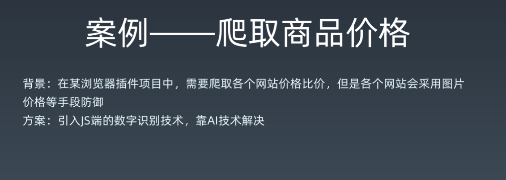

- 当时京东的价格有些偏贵了，所以不想让一淘去爬，所以做成了图片的形式
- 后来反爬成功了之后，京东就直接使用数字显示了，因为价格这种东西，也不好加个验证码之类的，会影响用户体验，所以防不住了，索性就不妨了  
- 这是某个晋升 P7 的案例，有些年头了，那时差不多是 13 年，那时候 AI 还不火，深度识别还不火
- 在晋升的时候，当时高级总监都觉得觉得这个在技术层面很厉害，给的评价非常的高，这一个点就直接通过了

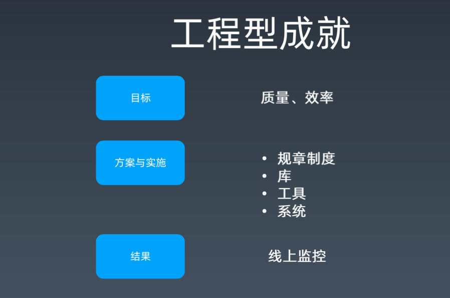

- 工程型的成就相对于比较容易，解决业务难题和技术难题还是比较少的， 在 winter 认识的人里面，有80%/90% 的人都是通过工程型的成就来晋升的。
- 质量和效率就像海绵里的水，挤一挤总是会有的 
- 阿里早年的搭建系统，搭建效率到现在的智能系统，总到找到一些提升的点，只要不是0成本，就总归能找到压缩成本的降低 
- 通过写一些库、工具、系统来帮助工程师来提升效率

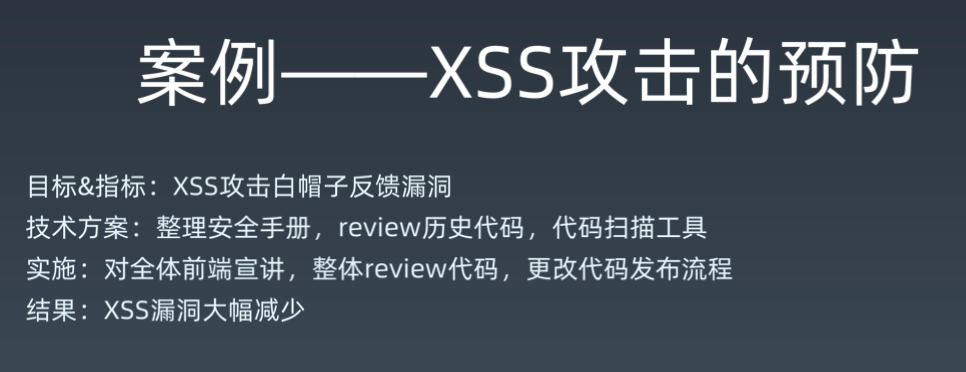

- 这种案例是一种工程上的案例，工程上不一定就是要你有一个什么实体拿出来，你可以是一个手册，可以是一个方案，可以是一个工具，这个工程所有的目标就是要有效

回答同学的问题

- 如何晋升

  - 晋升你首先要有一个领域，首先要选择哪个领域，比如前端工程里面有个搭建的领域，那么在搭建这一块你有没有什么方法论，有没有建立什么体系 

  - 早些年的阿里P7 的要求非常的强，就是在这个领域你要有人无我有，人有我强，现在其实不需要了，放松很多了，只需要你在这个领域上有一定的方案，能够解决这个领域所有的问题

- 如何读开源项目
  - 首先是给这个开源软件写文档，看看哪些写的不好，看看issue，所以逐渐的开始接一些 bugfix ，然后就可以把一个项目跑起来，然后跑起来之后就可以单步的追踪，然后根据单步的追踪来了解这个项目的结构，再大型的项目，也可以通过这个单步的追踪，来得到一个局部的脉络，然后就逐渐的熟悉，然后熟悉更多的脉络，再修更多的bug，然后请这个项目的负责人来做review，这个是比较深度的方式
  -  比较浅的就是打断点，然后不断的打断点来单步的追踪

- 前端能用到哪些数据结构
  - 较多的数组和二叉树，数组对应的线性表（说的是线性表还是链表？），二叉树对应的排序

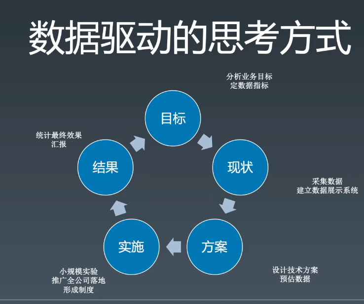

- 要明白公司的指标是什么，不要得到别人的评价是踏实肯干，老黄牛这些，要得到的是技术好，业务敏感度高，老板赏识，如果业务敏感度一点也没有，就会吃很大的亏的
- 要会数据的对比，也就是在重构之前要记录数据，要记录现状，你不能只有结果，不要上来就搞
- 实施要有小规模实验，有正向效果的时候，再去要资源
- 汇报是一定要有的，老板或者你的领导其实是很闲的，即使真的有很忙的领导，那也可以向他的秘书咨询汇报，
  - 不要只是产品经理才知道业务的目标，研发工程师也要去了解业务的目标

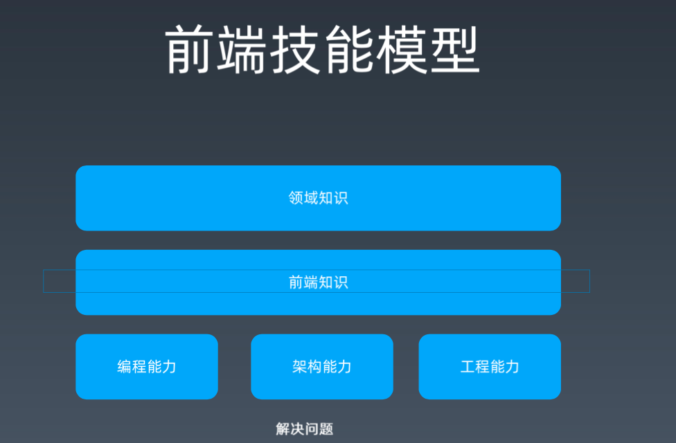

- 要知道这三种能力，编程能力、架构能力、工程能力，以及如何链接

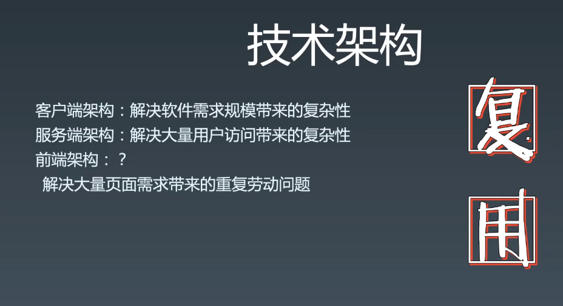

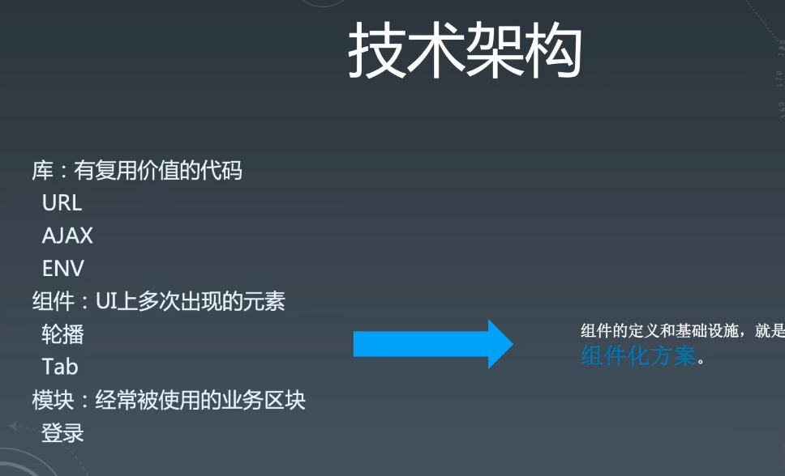