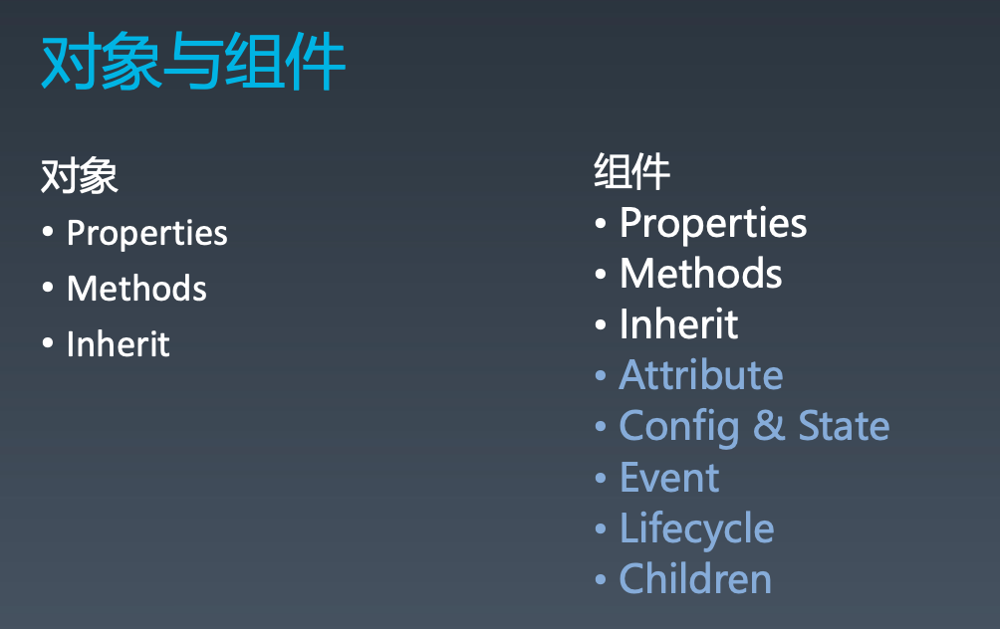
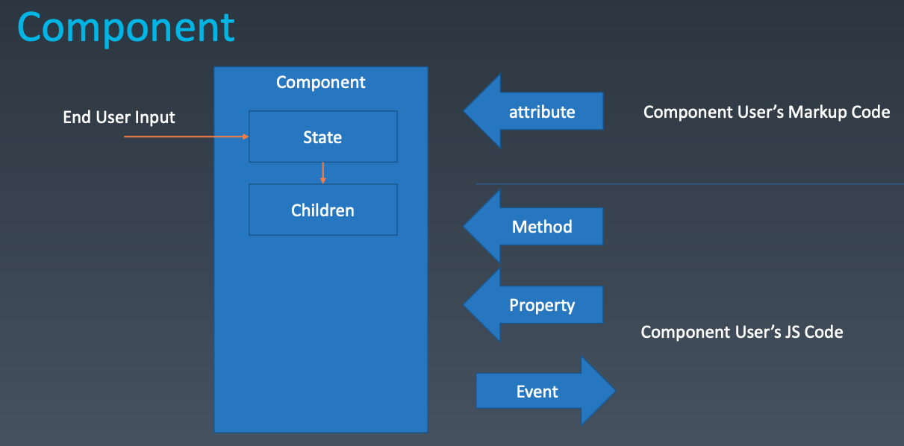
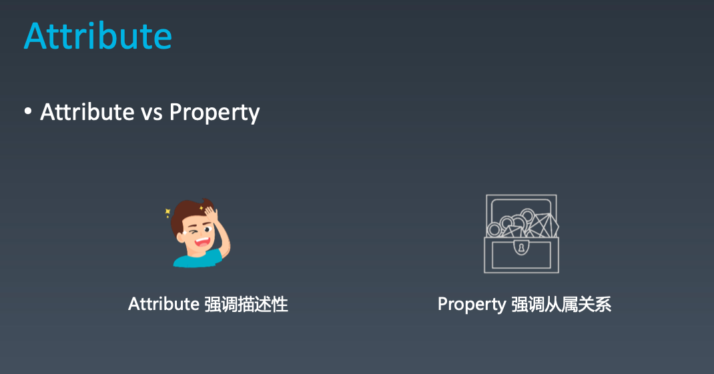
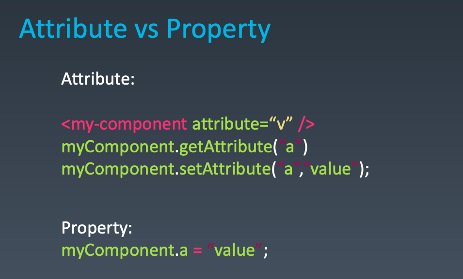
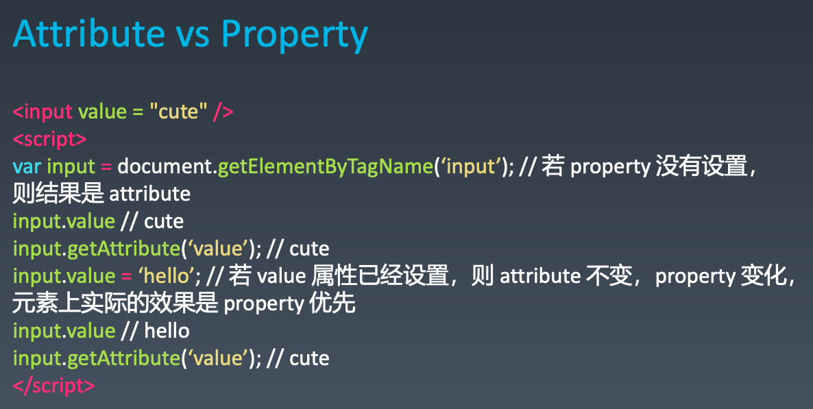
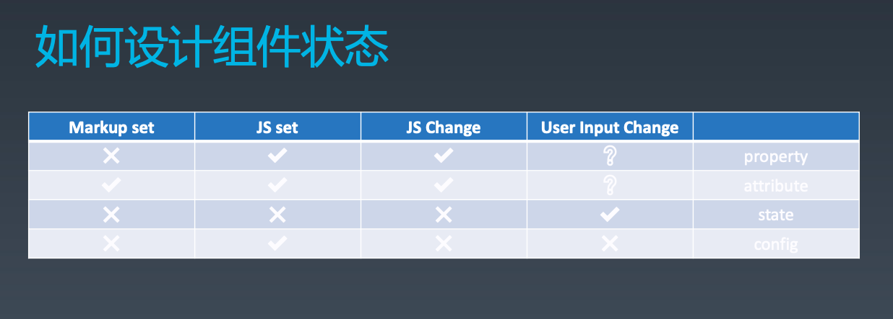
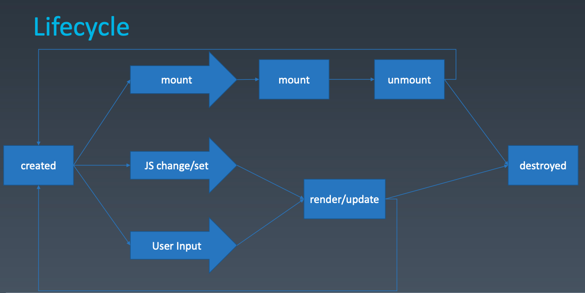
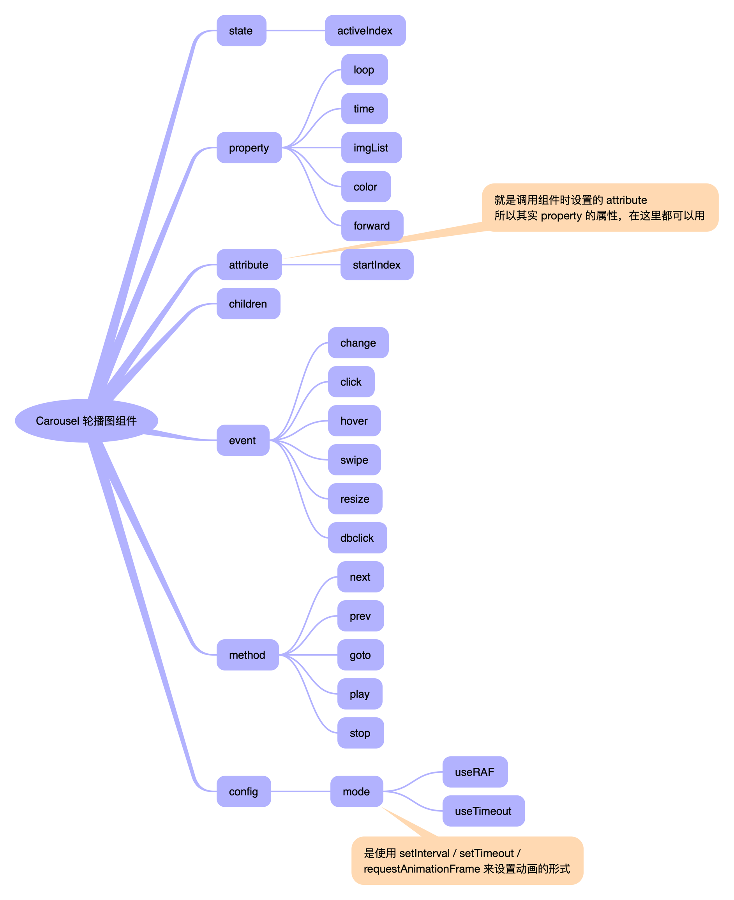

- 比如JS 里使用 Object.defineProperty 来修改 property ，表示从属关系
- 在HTML元素的时候的时候，JS都是调用 setAttribute 来修改属性，比如某个元素的 attribute 而不是元素的 property





- 也就是一旦使用JS来设置了 value 之后，使用 getAttribute 获取不到使用 .value 更改的值

- 在浏览器中，修改元素的 value 会同步在浏览器中Input的 value 进行修改

  - 但是在控制台中使用 $0.value 设置当前 input 的 value 后，在修改元素中，继续修改 value 的值，浏览器渲染里面的 value 仍然是控制台中设置的

  



- 一直没有明白前端的 markup 是什么东西

- 针对上面的 property / attribute / state / config 大概是什么样子

  - 在使用当前组件 `<MyComponent attr1=123 />` 这里面的 attr1 就是设置的 attribute，而不是config 

    > React 里的 attribute 和 property 是一样的，vue2 的 attribute / property 不一样，哪里不一样还得自己去看，winter 也没咋讲

```javascript
class MyComponent {
  constructor(config) {
    this.state = {
      i: 1
    }
  }

  // 定义每个 property 
  get prop1() {}

  set prop1() {}

  // 定义 attribute
  setAttribute(attr, value) {}

  getAttribute(attr) {}
  
  get children() {}
  
  set children() {}
}

<MyComponent attr1={123}>
```



- 设计一个 Carousel 轮播图组件，包含 state / property / attribute / children / event / method 

  > 其实也就是编写任何一个组件的时候，都可以这样来提前设计好，这就是组件化设计的过程

