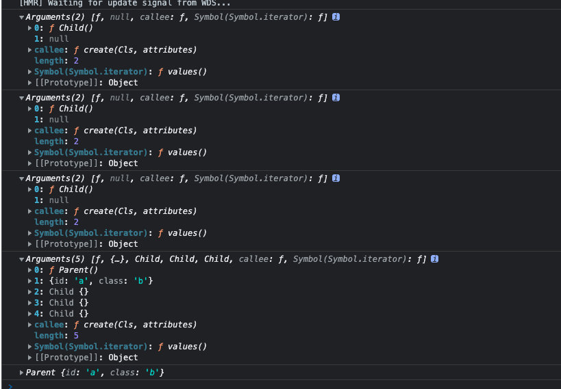

组件编写，让我们可以使用 jsx 来编写组件，这里不用到 React，由于 babel 支持，所以我们可以使用 `@babel/plugin-tramsform-react-jsx` 来实现，由于在写 jsx 的时候，会出现如果是大写的命名则使用组件解析，小写的命名则会使用字符串来解析

则这个插件中，默认会使用`React.createElement(Component, props, children)` 的形式，因为我们不引入 React，所以这里给插件设置 `{ pragma: "createElement" }` ，这样我们自己实现`createElement` 函数来解析写的 `jsx` 

最终写的完整版如下，项目启动可以在 `github.com/fedono/relearn-fe/components/component-with-jsx-2` 中查看


这一次我们使用 createElement 函数
```javascript
function createElement(Cls, attributes) {
  var o = new Cls();

  for (const name in attributes) {
    o[name] = attributes[name];
  }

  return o;
}

class Div {}

let component = <Div id="a" class="b" />;

console.log(component);
```

打印出来效果为
```javascript
Div {id: 'a', class: 'b'}
```

通过树形结构打印
```javascript
function createElement(Cls, attributes) {
  console.log(arguments);
  debugger;
  var o = new Cls();

  for (const name in attributes) {
    o[name] = attributes[name];
  }

  return o;
}

class Parent {}
class Child {}

let component = (
  <Parent id="a" class="b">
    <Child />
    <Child />
    <Child />
  </Parent>
);

console.log(component);
```

通过 debugger 来打印的结果显示，是先渲染的 Child，然后再渲染的 Parent




因为传给 createElement 的第三个参数是 children，所以我们修改一下
```javascript
function createElement(Cls, attributes, ...children) {
  var o = new Cls();

  for (const name in attributes) {
    o[name] = attributes[name];
  }

  console.log(children);
  return o;
}
```
然后我们就需要开始处理 children 了

这里我先修改一下 Parent 类，看下是需要如何来接收属性的
```javascript
function createElement(Cls, attributes, ...children) {
  var o = new Cls();

  for (const name in attributes) {
    // 这里设置属性的地方修改一下
    o.setAttribute(name, attributes[name]);
  }

  return o;
}

class Parent {
  // 这里的 set 和下面的 setAttribute 是两种增加属性的方式
  set class(v) {
    console.log("Parent::class", v);
  }

  setAttribute(name, value) {
    console.log(name, value);
  }
}
```

然后我们继续修改一下，可以添加 children
```javascript
function createElement(Cls, attributes, ...children) {
  var o = new Cls({
    timer: 0
  });

  for (const name in attributes) {
    o.setAttribute(name, attributes[name]);
  }

  for (let child of children) {
    // 可以有两种方式，设置基本的属性，或者设置方法来添加 children
    o.children.push(child);
    // o.appendChild(child);
  }

  return o;
}

class Parent {
  constructor(config) { 
    this.children = [];
  }
  
  // property
  set class(v) { 
    console.log("Parent::class", v);
  }

  // attribute
  setAttribute(name, value) { 
    console.log(name, value);
  }

  // children
  appendChild(child) {
    console.log("Parent::appendChild", child);
  }
}
class Child {}

let component = (
  <Parent id="a" class="b">
    <Child />
    <Child />
    <Child />
  </Parent>
);

console.log(component);

```

这时候我们把它修改成为一个可以生成 DOM 节点的
```javascript
function createElement(Cls, attributes, ...children) {
  var o = new Cls();

  for (const name in attributes) {
    o.setAttribute(name, attributes[name]);
  }

  for (let child of children) {
    // o.children.push(child);
    o.appendChild(child);
  }

  return o;
}

class Div {
  constructor(config) {
    this.children = [];
    this.root = document.createElement("div");
  }

  // attribute
  setAttribute(name, value) {
    this.root.setAttribute(name, value);
  }

  // children
  appendChild(child) {
    child.mountTo(this.root);
  }

  mountTo(parent) {
    parent.appendChild(this.root);
  }
}

let component = (
  <Div id="a" class="b">
    <Div />
    <Div />
    <Div />
  </Div>
);

component.mountTo(document.body);
```

继续优化，因为这是一个需要有生命周期的组件，所以不能获取到子组件的时候就直接添加进去，得父组件 mount 的时候再把子组件添加进来
这样我们才好设置生命周期
```javascript
function createElement(Cls, attributes, ...children) {
  var o = new Cls();

  for (const name in attributes) {
    o.setAttribute(name, attributes[name]);
  }

  for (let child of children) {
    o.appendChild(child);
  }

  return o;
}

class Div {
  constructor(config) {
    this.children = [];
    this.root = document.createElement("div");
  }

  // attribute
  setAttribute(name, value) {
    this.root.setAttribute(name, value);
  }

  // children
  appendChild(child) {
    this.children.push(child);
  }

  mountTo(parent) {
    parent.appendChild(this.root);
    for (const child of this.children) {
      child.mountTo(this.root);
    }
  }
}

let component = (
  <Div
    id="a"
    class="b"
    style="width: 100px;height: 100px;background-color: lightgreen;"
  >
    <Div />
    <Div />
    <Div />
  </Div>
);

component.mountTo(document.body);
```
又因为当组件名称是大写的时候，是一个类组件，是小写的时候，就是原生的组件了，所以需要区分处理
这时候如果是文本类型，他的 child 就只是一个文本，所以当子节点是文本类型的时候，需要区分处理，加上一个 Text 类来处理

```javascript
function createElement(Cls, attributes, ...children) {
  let o;
  if (typeof Cls === "string") {
    o = new Wrapper(Cls);
  } else {
    o = new Cls({
      timer: {},
    });
  }

  for (const name in attributes) {
    o.setAttribute(name, attributes[name]);
  }

  for (let child of children) {
    if (typeof child === "string") {
      child = new Text(child);
    }
    o.appendChild(child);
  }

  return o;
}

class Text {
  constructor(text) {
    this.root = document.createTextNode(text);
  }

  mountTo(parent) {
    parent.appendChild(this.root);
  }
}

class Wrapper {
  constructor(type) {
    this.children = [];
    this.root = document.createElement(type);
  }

  // attribute
  setAttribute(name, value) {
    this.root.setAttribute(name, value);
  }

  // children
  appendChild(child) {
    this.children.push(child);
  }

  mountTo(parent) {
    parent.appendChild(this.root);
    for (const child of this.children) {
      child.mountTo(this.root);
    }
  }
}

class Div {
  constructor(config) {
    this.children = [];
    this.root = document.createElement("div");
  }

  // attribute
  setAttribute(name, value) {
    this.root.setAttribute(name, value);
  }

  // children
  appendChild(child) {
    this.children.push(child);
  }

  mountTo(parent) {
    parent.appendChild(this.root);
    for (const child of this.children) {
      child.mountTo(this.root);
    }
  }
}

let component = (
  <Div
    id="a"
    class="b"
    style="width: 100px;height: 100px;background-color: lightgreen;"
  >
    <div />
    <p>text</p>
    <div />
  </Div>
);

component.mountTo(document.body);

```

最后就是一个差不多的完整版了，就是可以添加自定义组件和 HTML 元素，然后不断级联的添加
```javascript
function createElement(Cls, attributes, ...children) {
  let o;
  if (typeof Cls === "string") {
    o = new Wrapper(Cls);
  } else {
    o = new Cls({
      timer: {},
    });
  }

  for (const name in attributes) {
    o.setAttribute(name, attributes[name]);
  }

  for (let child of children) {
    if (typeof child === "string") {
      child = new Text(child);
    }
    o.appendChild(child);
  }

  return o;
}

class Text {
  constructor(text) {
    this.root = document.createTextNode(text);
  }

  mountTo(parent) {
    parent.appendChild(this.root);
  }
}

class Wrapper {
  constructor(type) {
    this.children = [];
    this.root = document.createElement(type);
  }

  // attribute
  setAttribute(name, value) {
    this.root.setAttribute(name, value);
  }

  // children
  appendChild(child) {
    this.children.push(child);
  }

  mountTo(parent) {
    parent.appendChild(this.root);
    for (const child of this.children) {
      child.mountTo(this.root);
    }
  }
}

class MyComponent {
  constructor(config) {
    this.children = [];
    this.root = document.createElement("div");
  }

  // attribute
  setAttribute(name, value) {
    this.root.setAttribute(name, value);
  }

  // children
  appendChild(child) {
    this.children.push(child);
  }

  render() {
    return (
      <article>
        <header>I'm a header</header>
        {this.slot}
        <footer>I'm a footer</footer>
      </article>
    );
  }

  mountTo(parent) {
    // slot 是一个容器组件，用来添加子组件
    this.slot = <div></div>;
    for (const child of this.children) {
      this.slot.appendChild(child);
      // child.mountTo(this.slot); 这里就不是 child.mountTo 了
    }

    // 这样写就是一个级联的结构了，先把子组件加到 slot 中，然后将slot 渲染出来，最后放到父级节点中去
    // qs 老实说我没有明白为什么这里是 this.render() 然后还要 mountTo 的，为什么这个可以级联
    // 因为每一个组件挂载的时候，都是挂载到父节点的，所以 this.render() 也是返回一个节点，所以这里 mountTo 也说得通
    // 所以这一节可以多看看，就是第 34节，为组件添加 jsx
    this.render().mountTo(parent);
  }
}

let component = (
  <MyComponent
    id="a"
    class="b"
    style="width: 100px;height: 100px;background-color: lightgreen;"
  >
    <div />
    <p>text</p>
    <div />
  </MyComponent>
);

component.mountTo(document.body);
```